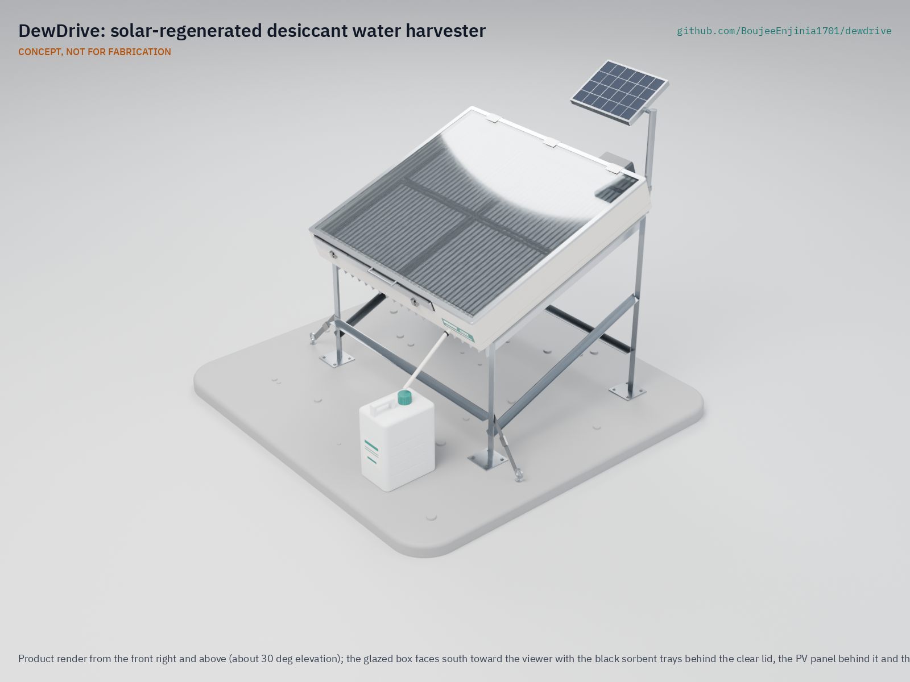

# DewDrive

     

**Area:** Water Security · **TRL:** 3 of 9 (proof of concept on paper) · **Prototype budget:** $520 USD · **Difficulty:** 4 of 5

Solar-regenerated desiccant harvester that adsorbs moisture from air overnight and releases it into a passive condenser during the day.

[Exploded render](media/render-exploded.png) · [Detail render](media/render-detail.png) · [Interactive 3D model](media/viewer.html) · [Concept blueprint (PDF)](media/concept-blueprint.pdf) · [General arrangement DWD-DWG-001 (PDF)](cad/drawings/DWD-DWG-001.pdf) · [Sizing calculations](docs/04-calcs/01-sizing.md) · [Review note](docs/REVIEW.md)

## Concept rationale

Cool desert nights are more humid than the days, and a salt-loaded desiccant can store that night-time moisture until the sun is strong enough to drive it out. DewDrive uses that daily rhythm directly: one glazed box that adsorbs at night and becomes a small solar still by day, with its own shaded floor as the condenser. It needs no compressor, no refrigerant and no grid, only a 2 W fan and the sun, and it keeps working at humidities where fog nets and dew condensers give nothing.

The design is open and garage-buildable on purpose. Silica gel and calcium chloride are sold as ordinary desiccants and food additives; the box is plywood, foam, polycarbonate and sheet aluminium; and the numbers behind every claim are in a script anyone can rerun. Commercial hydropanels are sealed products at about $2,000 each. An open design that a local workshop can build, repair and log lets communities and researchers compare real yields site by site.

## Burning platform

In 2022, 2.2 billion people still lacked safely managed drinking water, and 115 million collected untreated surface water from lakes, ponds, rivers and streams ([WHO, drinking-water fact sheet](https://www.who.int/news-room/fact-sheets/detail/drinking-water)). Over 2 billion people live in water-stressed countries, a pressure the WHO expects climate change and population growth to worsen in some regions (same source).

The cost falls hardest on the people who carry the water. UNICEF estimates that women and girls spend 200 million hours every day collecting it ([UNICEF, 2016](https://www.unicef.org/press-releases/unicef-collecting-water-often-colossal-waste-time-women-and-girls)). Even a supplementary half litre a day, made at the point of use, is water that nobody had to walk for.

## Where it could be used

### By industry

| Industry | Use |
| --- | --- |
| Humanitarian and WASH programs | Supplementary drinking water at schools, clinics and camps in arid areas, with logged yields to guide deployment |
| Agriculture and pastoralism | Drinking water at remote grazing posts and farm huts far from wells |
| Education and research | An open, instrumented test bed for sorbent and collector research across climates |
| Off-grid tourism and remote stations | Water for ranger posts, weather stations and eco-lodges supplied by truck |
| Emergency preparedness | A buildable backup source where wells or delivered supplies fail in drought |

### By country or region

| Country or region | Why it matters there |
| --- | --- |
| Navajo Nation, United States | About 30 % of homes lack running water, according to Navajo Nation Council Speaker Crystalyne Curley's testimony to the US Senate Committee on Indian Affairs on September 27, 2023 ([Senate Committee on Indian Affairs](https://www.indian.senate.gov/hearings/oversight-hearing-on-water-as-a-trust-resource-examining-access-in-native-communities/); [Native News Online](https://nativenewsonline.net/currents/senate-committee-on-indian-affairs-hears-30-of-navajo-nation-homes-lack-running-water)); a high-income country with households that haul water |
| Jordan | One of the most water-scarce countries in the world, with about 61 m³ of renewable water per person per year against a 500 m³ minimum ([UNICEF Jordan](https://www.unicef.org/jordan/water-sanitation-and-hygiene)) |
| Arid and semi-arid counties, Kenya | Access to safe water and basic sanitation is lowest in the arid and semi-arid land (ASAL) counties, where UNICEF focuses its water work with the government ([UNICEF Kenya](https://www.unicef.org/kenya/water-sanitation-and-hygiene)) |
| Rajasthan, India | In Thar Desert villages of northwest Rajasthan, water is scarce for up to 11 months of the year; women walk up to 4 km to fetch it, and villages store rainwater in underground taankas ([Al Jazeera, 2015](https://www.aljazeera.com/gallery/2015/11/19/women-lead-the-way-out-of-poverty-in-an-indian-desert)) |
| Atacama, Chile | In Alto Hospicio, only 1.6 % of informal settlements are connected to the water network and 75.4 % receive water by truck; researchers are assessing fog collection there as a complementary source ([Carter et al., *Frontiers in Environmental Science*, 2025](https://doi.org/10.3389/fenvs.2025.1537058)) |

## What sparked the idea

The starting point was a wartime device: the inflatable solar still that Mária Telkes developed at MIT during the Second World War for aircrews downed at sea. Seawater evaporated inside a balloon-like plastic envelope that folded into a package the size of a paper cup, and condensed again as drinkable water. The US government ordered 100,000 of them; by the summer of 1945 none had been delivered and the still was not used in the war, but solar stills later became part of military emergency kits ([USPTO, "A solar life"](https://www.uspto.gov/learning-and-resources/journeys-innovation/historical-stories/solar-life)). Telkes later patented a collapsible still, erected by inflation, as emergency equipment for the occupants of life rafts ([US Patent 3,415,719](https://patents.google.com/patent/US3415719A/en)). It showed that sunlight, a transparent envelope and a cool condensing surface can make drinkable water with no fuel at all. Telkes's still needed seawater. DewDrive asks what the same daytime still could do far from any sea, if a desiccant bed filled itself overnight from the desert air.

## Problem

Arid households without surface water or groundwater within reach depend on carried or trucked water; the air above them is an untapped supplementary source. Even desert air holds about 7 g of water per cubic metre on a 40 % RH night. Commercial solar hydropanels cost about $2,000 each and cannot be built or repaired locally. Design with, not for: requirements must come from co-design sessions and field trials with the intended users through a local partner.

Problem statement: [docs/01-problem.md](docs/01-problem.md)

## Concept

A glazed, insulated box 1.1 x 1.0 m, tilted 20° toward the sun, holds 4 kg of silica gel impregnated with 25 wt % calcium chloride in four sealed trays. At night the vent flaps are opened and a small solar-powered fan draws air in above the trays and down through the sorbent beds; the fan stops if the air goes above 70 % RH. By day the flaps are shut, the sun heats the sorbent to about 112 °C, and the vapour passes a black drip screen, condenses on the shaded, finned floor of the box and drains into a bottle. TRL 3 calculations ([DWD-CAL-001](docs/04-calcs/01-sizing.md)) for the design decided on 2026-09-25 ([DWD-DDR-002](docs/decisions/0002-recommendations-accepted.md)) give:

| Quantity | Estimate |
| --- | --- |
| Water at 40 % night RH | about 0.57 L per day (target 0.5 L) |
| Water at 25 % night RH | about 0.45 L per day (target 0.25 L) |
| Mass | about 54 kg dry; box about 33 kg |
| Parts cost | $515, within the $520 budget (top-up approved by Amish, 2026-09-26) |

One unit is a supplement: about one fifth of one person's survival drinking need.

Full design precis: [docs/02-concept.md](docs/02-concept.md)

## Key components

- Silica gel and calcium chloride composite sorbent in four black, sealed trays, with air drawn through the beds at night
- Drip screens with brine sumps under the trays
- Glazed, insulated solar box on a tilted steel stand
- Finned aluminium condenser forming the shaded floor of the box
- Night fan with a 10 W PV panel and a small LiFePO4 battery
- Humidity and temperature logging

The priced bill of materials is in [bom/bom.csv](bom/bom.csv). The parametric model is [cad/src/model.py](cad/src/model.py), with STEP files in `cad/step/`.

## Safety

> **Safety:** Harvested water must be tested and treated before drinking. The box interior and glazing get hot enough to burn, calcium chloride irritates eyes and skin, the small lithium iron phosphate battery must be fused, and the tilted panel must be held down with two ground anchors (or about 50 kg of ballast) against wind. See the safety section of the [design precis](docs/02-concept.md).

## Repository layout

| Folder | Contents |
| --- | --- |
| `docs/` | Problem, concept, requirements, calculations and design decisions |
| `cad/src/` | build123d Python source, the source of truth for all geometry |
| `cad/step/`, `cad/stl/` | Exported models for FreeCAD, other CAD tools and printing |
| `cad/drawings/` | 2D sketches and dimensioned drawings |
| `bom/` | Bill of materials |
| `electronics/` | KiCad schematics and PCB layouts |
| `firmware/` | Microcontroller code |
| `media/` | Renders, perspectives and photos |
| `build-log/` | Dated prototyping notes |

## Documentation

Controlled documents follow the portfolio [documentation standard](.kit/STANDARDS.md). Each carries a document ID (DWD-PRC-001 for the precis), a version and a revision history. Branded PDFs are built with `python .kit/render.py` and attached to GitHub Releases when a document is tagged, for example `DWD-PRC-001/v1.0`.

## Credits

Designed by Amish Chadha. See [CONTRIBUTORS.md](CONTRIBUTORS.md) for roles. To cite this design, use [CITATION.cff](CITATION.cff) (GitHub shows it as "Cite this repository").

AI assistance (Claude) was used to accelerate concept renders, prototype documentation and first-pass sizing calculations. Design direction and all decisions are Amish Chadha's, recorded in this repository's decision records (`docs/decisions/`).

## Licenses

- **Hardware** (CAD, drawings, BOM, electronics): [CERN-OHL-S v2](LICENSE)
- **Software** (firmware, scripts, notebooks): [MIT](LICENSE-SOFTWARE)

A project of the [Design Molecule](https://designmolecule.com) lab.
