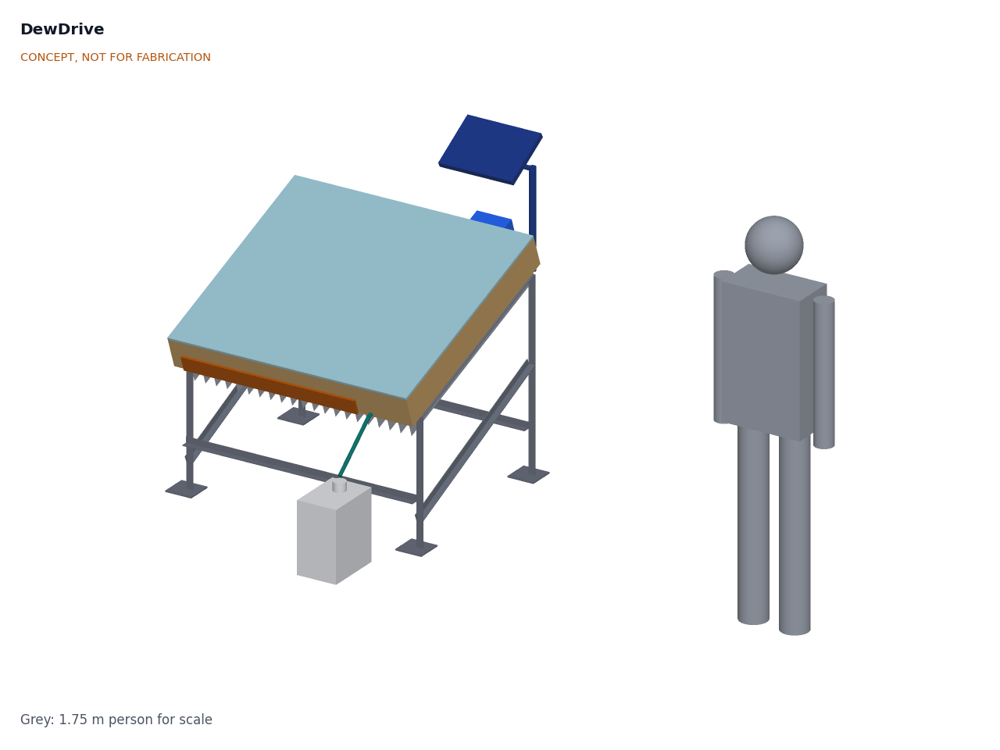
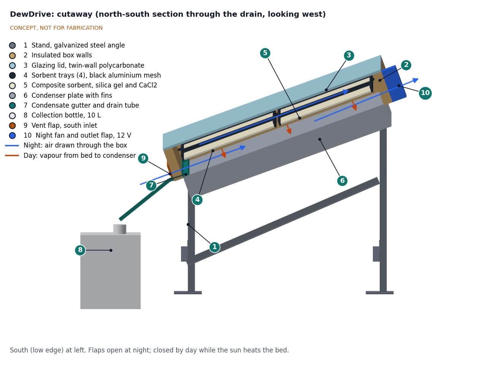
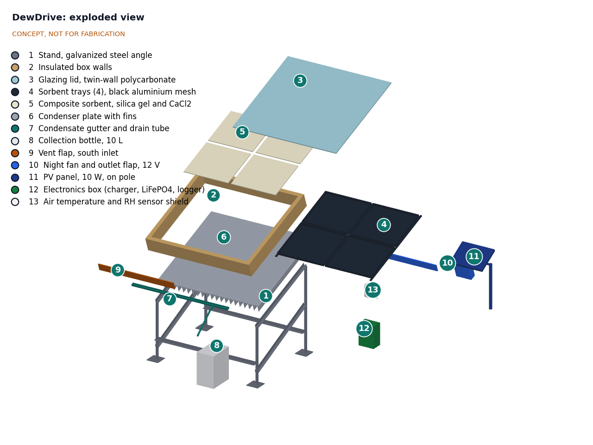
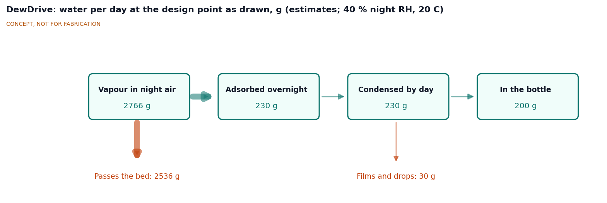

# DewDrive design precis

DewDrive is a glazed, insulated box 1.1 x 1.0 m, tilted 20° toward the sun on a steel stand. Inside, four black trays hold 4 kg of silica gel impregnated with calcium chloride. At night the vent flaps are opened and a 2 W fan draws air through the box, and the sorbent takes up water. In the morning the flaps are shut; the sun heats the bed to about 104 °C by noon and drives the vapour down onto a finned aluminium floor that forms the condenser, shaded by the box itself. The condensate runs down the slope into a gutter and a 10 L bottle. The TRL 3 calculation (DWD-CAL-001) shows that the design as drawn makes only about 0.20 L per day at 40 % night RH and 0.09 L at 25 %, well short of the 0.5 and 0.25 L targets, because night air that flows past the trays leaves most of its vapour behind. Drawing the air down through the mesh-floored trays would give about 0.53 and 0.35 L per day; that change is proposed, awaiting Amish. Parts cost $488 against the $500 budget. One unit supplements drinking water; it does not replace a water supply.

*Figure 1. DewDrive on its stand, with a 1.75 m person for scale. Glazing faces south (for a northern-hemisphere site), the collection bottle sits below the low edge and the 10 W PV panel is on a pole to the north, where it cannot shade the box. Generated from the parametric model `cad/src/model.py`.*

## How it works

1. **Adsorb at night.** In the evening the user opens the south inlet flap and the north outlet flap. The logger switches on the fan, which draws 40 m³/h of night air through the box, over and under the four sorbent trays, for 10 h. The CaCl₂ in the silica gel pores binds water first as hydrates and then as a solution held in the pores; the silica gel adds a little uptake of its own and keeps the solution from dripping.
2. **Seal and heat by day.** In the morning the user shuts both flaps. Sunlight passes through the twin-wall polycarbonate and heats the black top faces of the trays. The bed passes 85 °C by 09:00 and reaches about 104 °C at noon, and its vapour pressure rises above that of the condenser.
3. **Condense.** Vapour diffuses down through the 65 mm gap under the trays to the aluminium floor plate, which stays within about 13 K of ambient thanks to 21 fins in the shade under the box.
4. **Collect.** Water films run down the 20° slope to a gutter along the low edge and drain through a silicone tube into a food-grade jerrycan.
5. **Log.** The logger records air temperature and RH, bed and condenser temperatures every 5 min; the user weighs the bottle each day. The data make yields comparable between sites.

*Figure 2. North-south section through the drain, looking west. Blue arrows: night air path with the flaps open. Red arrows: daytime vapour path from the bed (5) to the condenser floor (6). The gutter (7) along the low edge drains to the bottle (8).*

## Main components

Table 1. Main components. Numbers match `bom/bom.csv`, drawing DWD-DWG-001 and Figures 2 and 3.

| # | Component | Choice | Notes |
| --- | --- | --- | --- |
| 1 | Stand | Galvanized steel angle 30 x 30 x 3 mm, four legs, bolted; tilt 20° | Separable from the box; two ground anchors or about 50 kg of ballast (DWD-CAL-001, H2 to H4) |
| 2 | Insulated box walls | Plywood skins with 25 mm PIR foam, 1,100 x 1,000 x 140 mm, 40 mm thick | Open top (glazing) and bottom (condenser) |
| 3 | Glazing lid | 10 mm UV-stabilized twin-wall polycarbonate, hinged on the north edge | Must be rated above the 105 °C stagnation temperature |
| 4 | Sorbent trays (4) | Aluminium pans 490 x 430 x 25 mm with stainless mesh floors; black top, bare underside | Lift out for recharging the sorbent |
| 5 | Composite sorbent | 4 kg: 2.7 kg mesoporous silica gel with 1.3 kg CaCl₂ (about 33 wt %) | Bed 8.3 mm deep on 0.785 m²; all food-grade |
| 6 | Condenser | 2 mm aluminium floor plate with 21 fins, 1 x 100 x 920 mm at 50 mm pitch | Wetted face food-safe coated |
| 7 | Gutter and drain tube | Gutter along the low edge; food-grade silicone tube | |
| 8 | Collection bottle | 10 L HDPE jerrycan | About 50 days of production at the as-drawn yield |
| 9 | Vent flap, south inlet | Hinged flap 800 x 70 mm with EPDM seal and latches | Closed by day; seal quality sets the vapour loss |
| 10 | Night fan and outlet flap | 12 V 120 mm fan, about 2 W, on the north wall | Fan switched by the logger |
| 11 | PV panel | 10 W, 12 V, on a pole north of the box | Runs fan and logger |
| 12 | Electronics box | PWM charge controller, 12.8 V 6 Ah LiFePO4 with BMS, ESP32 logger | Only low-voltage DC on the device |
| 13 | Sensors | Air T and RH in a radiation shield; bed and condenser probes | |

Item 14 (hardware and consumables) is in the BOM but not modelled. The general arrangement is drawing DWD-DWG-001 (`cad/drawings/`); the STEP files are in `cad/step/`.

*Figure 3. Exploded view with BOM numbers.*

## Numbers from DWD-CAL-001

All values are first-principles estimates from `docs/04-calcs/sizing.py`; the tag after each value is the line of the script output that carries it. The sorbent isotherm is built from bulk salt data and must be replaced by measured isotherms of the actual composite.

*Figure 4. Water per day at the design point as drawn (40 % night RH, 20 °C). All values are estimates.*

Table 2. Water, energy, size and cost.

| Quantity | As drawn | Basis | Requirement |
| --- | --- | --- | --- |
| Vapour carried through the box overnight | 2.77 kg (B4) | 40 m³/h for 10 h at 6.92 g/m³ | |
| Share of the vapour driving force captured | 11 % (B2) | Laminar flow past the trays, about 1.7 W/(m²·K) | |
| Overnight uptake | 0.23 kg (B5) | Cyclic simulation; equilibrium would allow 2.03 kg (A4) | |
| Collected at 40 % night RH | 0.20 L per day (C3) | 0.23 kg condensed less 30 g of films | **R1 not met** |
| Collected at 25 % night RH | 0.09 L per day (C4) | Same model | **R2 not met** |
| Collected with the through-flow option | 0.53 L per day at 40 %, 0.35 L at 25 % (C5) | Air drawn down through the bed | Would meet R1 and R2 |
| Bed temperature at noon | 104 °C (C2) | 785 W/m² peak; 4.24 kWh/m² from 09:00 to 15:00 (C1) | R3 met |
| Condenser rise above ambient, peak | 13.1 K (C2) | Load 328 W peak; UA 24.6 W/K (C8) | R5 met, thin margin |
| Where the sun goes | 3.68 kWh absorbed; 0.17 kWh desorbs water; 1.51 kWh lost through the glazing; 1.96 kWh to the condenser (C6) | Beads radiate to the condenser through the mesh floor | |
| Solar-to-water efficiency | 2.5 % (C6); 6.5 % with through-flow (C7) | Published devices reach about 9 % (LaPotin et al., 2021) | |
| Stagnation temperature, dry bed | 105 °C (D1) | Noon, 35 °C air | Glazing rating to check |
| Electrical use and supply | 23.6 Wh per day against 35 Wh (F1); 2.6 days of autonomy (F2) | Fan 2 W for 10 h; logger 0.15 W | R4 met |
| Mass | 51.4 kg (113 lb) dry; box 30.9 kg, 24.0 kg with trays out (G1, G2) | Model volumes | R9 met |
| Wind at 20 m/s | 317 N normal to the lid; tips without 49 kg of ballast or two anchors (H1 to H4) | Force coefficient 1.2 on 1.1 m² | R10 not verifiable at TRL 3 |
| Parts cost | $488 (J1) | `bom/bom.csv` | R11 met ($500) |
| Water per dollar over 5 years | about $1.34 per litre as drawn; about $0.51 with through-flow (J2) | Parts only | For comparison |

What the numbers say:

- **The night airflow limits the yield, not the sun or the sorbent.** Air that flows past the trays at about 0.1 m/s passes on only about 11 % of its vapour. A bigger fan barely helps (80 m³/h gives 0.21 L per day, C10). Drawing the same air down through the bed captures nearly all of the driving force for 0.15 Pa of extra pressure drop, and lifts the yield to about 0.53 L per day.
- **The bed has heat to spare, but half of it leaks to the condenser.** The beads, seen through the mesh floors, radiate about 2 kWh a day onto the condenser. The condenser still stays within 13.1 K of ambient, but a low-emissivity screen under the trays would cut its load.
- **The salt loading is too high for humid nights.** At 33 wt % the solution fills the pores above 51 % RH (E2). About 25 wt % keeps it inside up to about 71 % RH (E5) and still gives about 0.51 L per day with through-flow (C11).
- **Yield is modest even when fixed.** At about 0.5 L per day, one unit provides about one fifth of one person's survival drinking need.

## Key design choices

Choices 1 to 7 were decided by Amish on 2026-09-25 (DWD-DDR-001, going with the recommendation). Choice 8 was part of the design from the start.

1. **Single-stage, flat glazed box** rather than a dual-stage or tubular design (D4). Dual-stage could add about 20 % in later versions (LaPotin et al., 2021).
2. **Silica gel and CaCl₂ composite** at about 33 wt % salt, rather than MOF, zeolite or LiCl (D3). DWD-CAL-001 proposes lowering the loading to about 25 wt %; see Open questions.
3. **Condenser as the shaded floor of the box**, directly below the bed (D4). Short vapour path, no pump, one fewer seal.
4. **Fan-assisted night airflow** with a 10 W PV panel and a 12.8 V LiFePO4 battery, rather than natural airflow (D5).
5. **Manual flaps** opened and closed by the user, rather than automatic actuators (D6).
6. **20° tilt, fixed**, facing the equator, with twin-wall polycarbonate glazing rather than glass (D7).
7. **Design point** of 20 °C and 40 % RH at night and 6.0 kWh/m² of sun, with a 25 % RH low-humidity case (D8).
8. **Built-in logging** so that each prototype yields comparable data.

## Safety

> **Safety:** Harvested water must be tested and treated before drinking. Condensed water is close to distilled, but it can pick up bacteria, dust, salt from the sorbent and metal from the condenser. Until a laboratory test shows otherwise, boil or disinfect it and do not use it as the only drinking source. Distilled-like water also lacks minerals.

> **Safety:** The inside of the box gets hot enough to burn: an estimated 104 °C in the bed at noon and about 105 °C with a dry bed (DWD-CAL-001, C2 and D1). The glazing outer skin reaches about 53 °C and the condenser fins about 48 °C. Open the lid only when cool, wear gloves when handling trays, and label the glazing. The polycarbonate must be rated above the stagnation temperature.

> **Safety:** Calcium chloride irritates eyes and skin and gives off heat when it dissolves. Wear gloves and eye protection when preparing the sorbent. At the present loading the solution can fill the pores above 51 % RH and weep a corrosive brine (DWD-CAL-001, E2); keep trays level, close the flaps in humid or rainy weather, and never let the solution reach the water path.

> **Safety:** The 12.8 V LiFePO4 battery has a built-in BMS and must be fused at the battery. Keep the electronics box shaded, and do not charge a damaged or swollen battery.

> **Safety:** The tilted lid catches the wind like a sail (317 N at 20 m/s). Without restraint the unit tips over (DWD-CAL-001, H2). Fit two ground anchors or about 50 kg of ballast before loading the box. Deburr all aluminium fins and sheet edges; fins under the box are at ankle and hand height.

## Open questions

- [ ] What are the measured uptake isotherms of the chosen composite at 20 °C and at 80 to 105 °C? These set every yield number.
- [ ] Should night air be drawn down through the mesh-floored trays instead of past them? DWD-CAL-001 says this is what it takes to meet R1 and R2 (proposed, awaiting Amish).
- [ ] Should the salt loading drop to about 25 wt % to keep the solution in the pores, and should a drip tray or a humidity cut-out on the fan protect against wet spells (proposed, awaiting Amish)?
- [ ] Would a low-emissivity screen under the trays cut the heat that leaks from the bed to the condenser enough to justify its cost?
- [ ] How much salt carries over into the condensate, and does the aluminium condenser need a coating or a stainless replacement?
- [ ] How well do simple flap seals hold vapour during the day?
- [ ] Which site and partner provide the humidity and solar data for the design point (DWD-DDR-001, O1)?
