# DewDrive prototype build plan

**Plan, not yet built.** How to build the first proof-of-concept prototype, component by component. Building and testing to it is TRL 4 work. Decisions still to be made are kept in the design decisions register ([docs/06-design-decisions.md](06-design-decisions.md)), not here.

## 1. What you are building

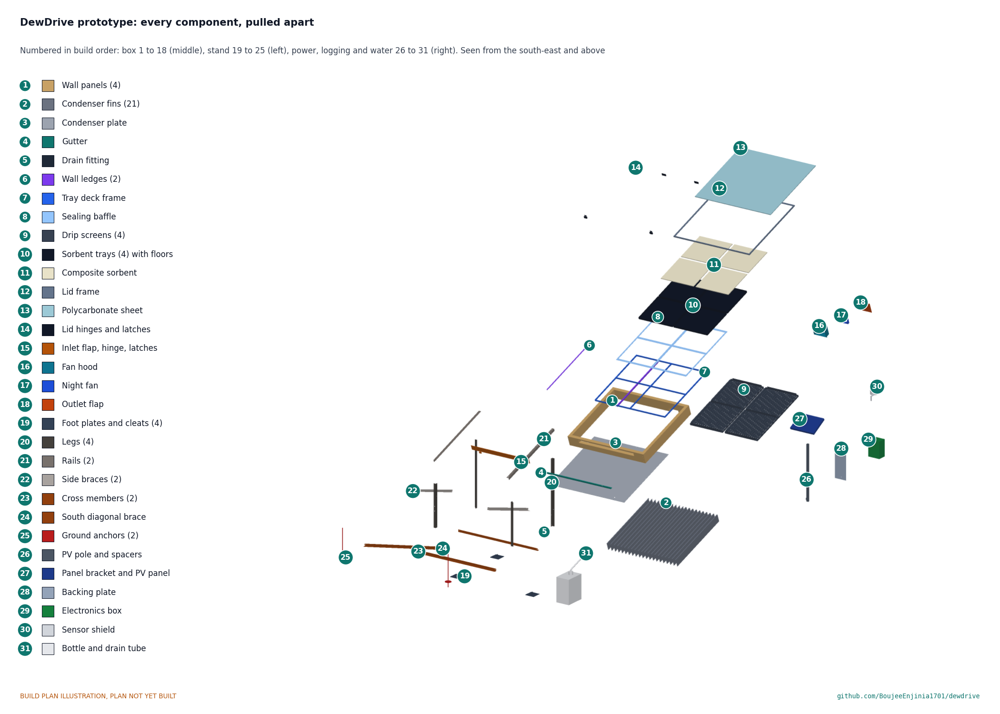

*Figure 1. Every component pulled apart and numbered in build order: the box in the middle, the stand on the left, power, logging and water on the right.*

The prototype is one DewDrive: a glazed, insulated box 1,100 x 1,000 mm, tilted 20° toward the sun on a bolted steel stand. Inside the box, four black trays of sorbent sit on a removable deck, with a drip screen hung under each tray; the box's aluminium floor is the condenser, with fins underneath. A small fan in a hood on the north wall draws night air through the beds; a 10 W panel and a battery box on the stand's north legs run the fan and the logger. Figure 1 shows the 31 components in the order you make or fit them. Twenty are made in a home or small workshop from plywood, softwood, foam board, aluminium sheet, bar and angle, and galvanized steel angle: the four wall panels, the condenser plate and fins, the gutter, the ledges, the tray deck and baffle, the drip screens, the trays, the lid frame, both flaps, the fan hood, and every stand part. The sorbent is mixed by hand. Everything else is bought and fitted. The work is woodworking with glue and screws, cutting, folding, drilling and riveting thin aluminium, drilling and bolting steel angle, and wiring bought 12 V modules. The parts cost about $620 from the bill of materials.

> **Safety:** The sorbent is made with calcium chloride, which irritates eyes and skin and gets hot as it dissolves; wear gloves and eye protection. In sun the inside of the box passes 110 °C: open the lid and handle trays only when cool. The 12.8 V lithium iron phosphate battery must be fused at the battery. The tilted lid catches the wind: anchor the stand before the box goes on it. Cut aluminium and steel edges are sharp; deburr everything. Harvested water must be tested and treated before anyone drinks it.

## 2. What changed to make it buildable

The concept showed what DewDrive does; many of its parts could not be made or fixed as drawn. Each change below keeps what the unit does, and all of them are recorded in decision record DWD-DDR-003, open for Amish's review.

*Table 1. Changes from the concept.*

| Component | The concept had | The buildable design has | Why |
| --- | --- | --- | --- |
| Condenser plate | A plate inside the walls, overlapping them, with no fixing | The plate closes the bottom of the box; the walls stand on it on gasket tape and 24 screws go up into the walls (Figure 5) | Seals the box and needs no extra frame |
| Walls | A solid block | Four sandwich panels with softwood battens round their edges, screwed at the corners (Figures 2 to 4) | Gives timber wherever a screw goes |
| Tray support | A thin baffle sheet on two loose rails | A lift-out deck of aluminium bars with the baffle riveted on top, resting on two wall ledges (Figures 12 to 14) | Carries four full trays and lifts out for cleaning |
| Drip screens | Floating under the trays with nothing holding them | A riveted frame hung from the deck bars by its sump and end plate (Figures 15 and 16) | Comes out with the deck; never touches the condenser |
| Fins | Thin strips standing on their edges | Fins with a folded foot, bonded and riveted (Figures 7 and 8) | An edge cannot be fixed; a foot can |
| Gutter and drain | A closed channel water could not enter, draining through the wall | A folded gutter in the low corner and a drain fitting down through the floor (Figures 9 and 10) | Water leaves by gravity without touching wood |
| Outlet | A separate outlet flap beside the fan, which would have let the fan draw air past the beds | One slot under the deck, into a hood that holds the fan; the outlet flap closes the fan opening (Figures 22 and 23) | All the air now passes down through the beds |
| Inlet opening | No room above it for the wall's top edge | The same opening 20 mm lower, still above the deck (Figure 21) | The wall keeps a solid top for the lid seal |
| Lid | A loose sheet | A sheet in an aluminium edge frame, with hinges, latches and a seal (Figures 18 and 19) | Holds the sheet and seals the box by day |
| Stand | Rails running through the box, no joints, no bracing | Rails under the box edges bolted into the walls; legs, braces, cross members and a diagonal, all bolted (Figures 24 to 35) | Every joint is face to face and bolted; the frame cannot rack |
| PV pole, electronics | The pole through the box; the electronics in mid-air | A square tube on spacers on the north-east leg; a backing plate on the north-west leg (Figures 36 to 39) | Fixed to the stand, clear of the box |
| Trays | Thick blocks with a sagging mesh floor | Folded 1 mm pans with a perforated floor under the mesh (Figure 17) | Same size and bed; the floor carries the sorbent |

## 3. Making the components

Make and check each component before the assembly step that needs it. Sizes are in millimetres. "Box frame" heights are measured up from the bottom edge of the walls, as if the box lay flat on a bench; "east" and "west" are as seen standing south of the unit, facing the glazing. Workshop tolerance is 1 mm for wood and 0.5 mm for metal unless a step says otherwise; drawings do not carry tolerances before TRL 4.

### 3.1 Wall panels (make 4)

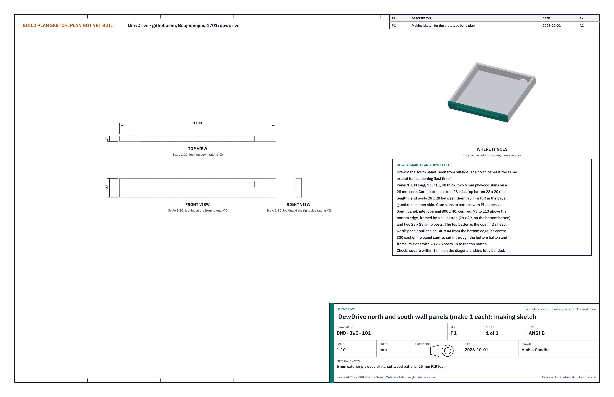

*Figure 2. North and south panels (DWD-DWG-101); the south panel has the inlet opening, the north panel the outlet slot.*

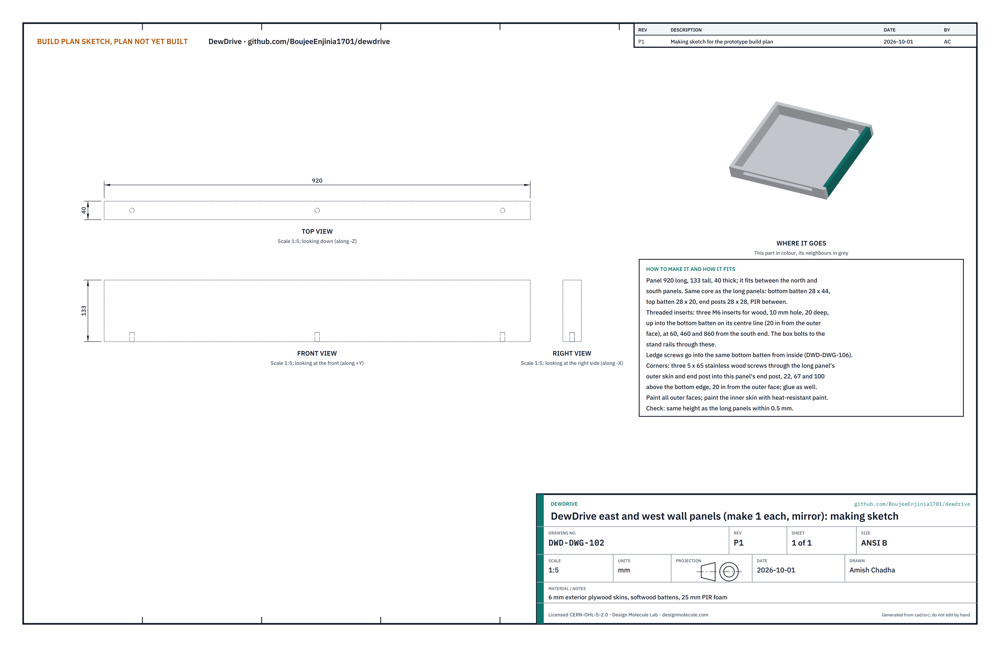

*Figure 3. East and west panels (DWD-DWG-102), with the threaded inserts for the stand bolts.*

**What it is and what it is made from.** The four insulated sides of the box, each 133 tall and 40 thick: two 6 mm exterior plywood skins glued to a 28 mm core of planed softwood battens, with 25 mm PIR foam board in the bays. North and south panels are 1,100 long; east and west panels are 920 long and fit between them.

**How to make it.**

1. Cut eight skins from one 1.2 x 2.4 m sheet of 6 mm exterior plywood: four 1,100 x 133 and four 920 x 133.
2. Cut the battens for each panel: a bottom batten 28 x 44 and a top batten 28 x 20, both full length; and two end posts 28 x 28, 69 long, to fit between them.
3. South panel: cut the inlet opening, 800 x 40, centred along the panel, from 73 to 113 above the bottom edge, through both skins. Frame it with a sill batten 28 x 29 sitting on the bottom batten and two 28 x 28 jamb posts beside the opening; the top batten is the opening's head.
4. North panel: cut the outlet slot, 140 wide and 44 tall from the bottom edge, its centre 330 east of the panel's centre. Cut the bottom batten away over the slot and fit a 28 x 28 post each side of it, from the bottom batten up to the top batten.
5. Glue the battens to the inner skin with polyurethane construction adhesive. Glue PIR board into the bays against the inner skin; it leaves a 3 mm air gap under the outer skin. Glue the outer skin on and weight the panel flat until set.
6. East and west panels: drill three 10 mm holes 20 deep up into the bottom batten, on its centre line (20 in from the outer face), at 60, 460 and 860 from the south end, and screw in M6 threaded inserts for wood.
7. Paint the outer faces with exterior paint and the inner faces with heat-resistant paint.

**How it fits the parts next to it.**

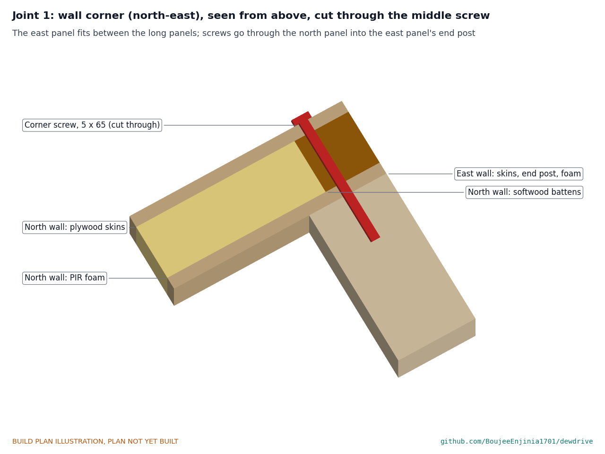

*Figure 4. The east panel fits between the long panels; each corner screw passes through the north panel and into the east panel's end post.*

The east and west panels fit between the north and south panels. At each corner, three 5 x 65 stainless wood screws go through the long panel's outer skin and end post into the short panel's end post, 22, 67 and 100 above the bottom edge and 20 in from the outer face, with adhesive on the joint. The bottom battens take the condenser plate screws and the ledge screws; the top battens take the lid hinges and latches.

**Check before moving on.** The assembled box is square within 2 mm on its diagonals and its top and bottom edges are flat within 1 mm.

### 3.2 Condenser plate and fins

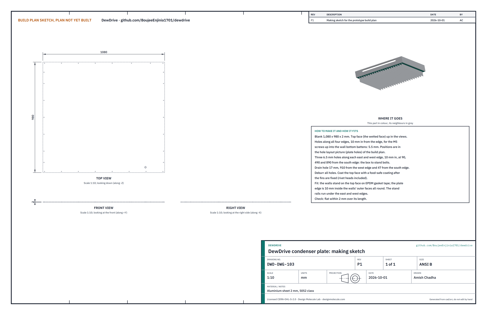

*Figure 5. Condenser plate (DWD-DWG-103).*

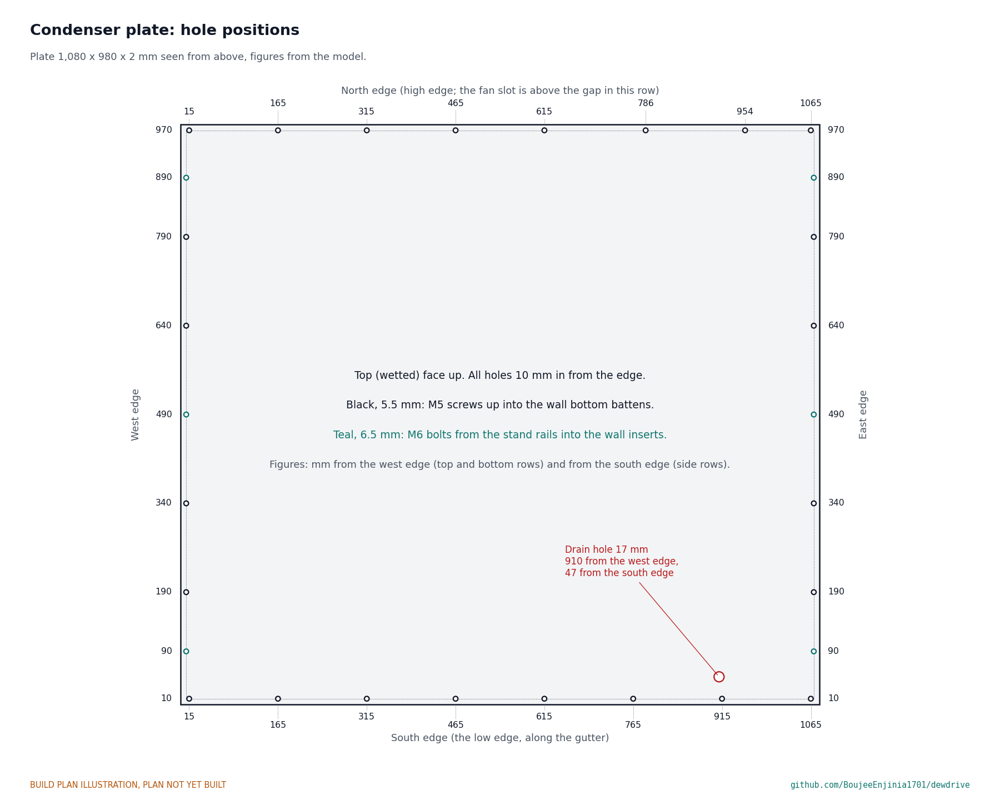

*Figure 6. Every hole in the plate, measured from the west and south edges.*

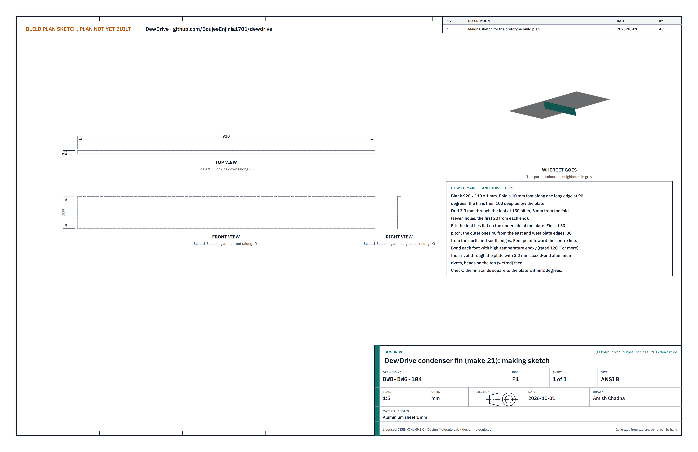

*Figure 7. Condenser fin (DWD-DWG-104).*

**What it is and what it is made from.** The floor of the box, where the vapour condenses, with 21 fins underneath that keep it cool in the box's own shade. Plate: aluminium sheet 2 mm, 5052 class, 1,080 x 980. Fins: aluminium sheet 1 mm, each 920 x 110 before folding.

**How to make it.**

1. Cut the plate square. Mark and drill the holes of Figure 6, all 10 in from the edges: 24 holes of 5.5 mm for the wall screws, six of 6.5 mm for the stand bolts (three along each east and west edge, at 90, 490 and 890 from the south edge), and the 17 mm drain hole 910 from the west edge and 47 from the south edge. Deburr.
2. Cut 21 fin blanks 920 x 110. Fold a 10 mm foot along one long edge of each, at 90°. Drill seven 3.3 mm holes through each foot, 5 from the fold, at 150 pitch, the first 20 from each end.
3. Turn the plate over (top face down) on a clean bench. Mark the fin lines at 50 pitch, the outer two 40 from the east and west edges; each fin runs 30 short of the north and south edges. The feet point toward the centre line.
4. Bond each foot with high-temperature epoxy (rated 120 °C or more), drill through the plate from the foot's holes, and fix with 3.2 mm closed-end aluminium rivets, heads on the top face.
5. Once the epoxy has cured, clean the top face and coat it, rivet heads included, with a food-safe coating.

**How it fits the parts next to it.**

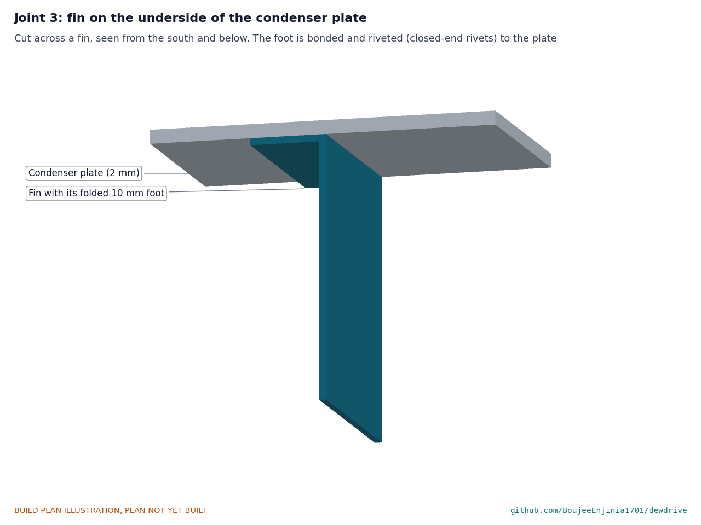

*Figure 8. The fin's foot lies flat on the underside of the plate.*

The walls stand on the top face on EPDM gasket tape, the plate edge 10 inside the walls' outer faces all round; M5 button-head stainless screws go up through the plate into the bottom battens (step 3). The stand rails run under the east and west edges, where three bolts go up through the plate into the wall inserts (Figure 24).

**Check before moving on.** Every fin stands square to the plate within 2°, and the drain hole sits between two fins with room for the fitting's nut.

### 3.3 Gutter and drain fitting

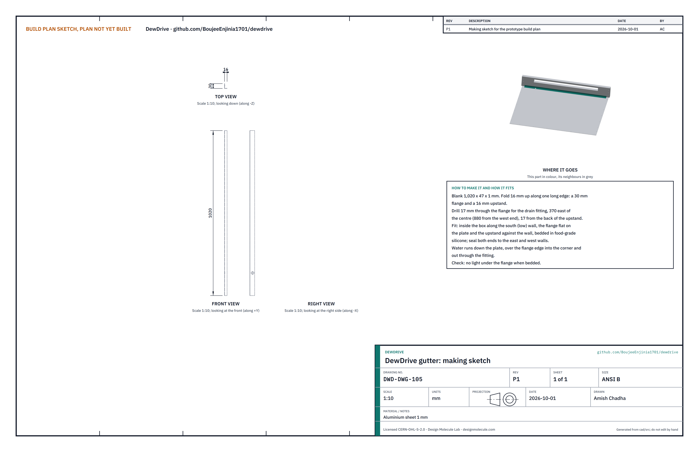

*Figure 9. Gutter (DWD-DWG-105).*

**What it is and what it is made from.** A folded aluminium angle that lines the low (south) corner of the box, where the condensate collects, and a bought food-grade bulkhead fitting with a 12 mm hose barb that drains it through the floor. Gutter: aluminium sheet 1 mm, 1,020 x 47 before folding.

**How to make it.**

1. Cut the blank 1,020 x 47 and fold 16 up along one long edge: a 30 flange and a 16 upstand.
2. Drill 17 mm through the flange 880 from its west end, 17 from the back of the upstand. This lines up with the plate's drain hole.

**How it fits the parts next to it.**

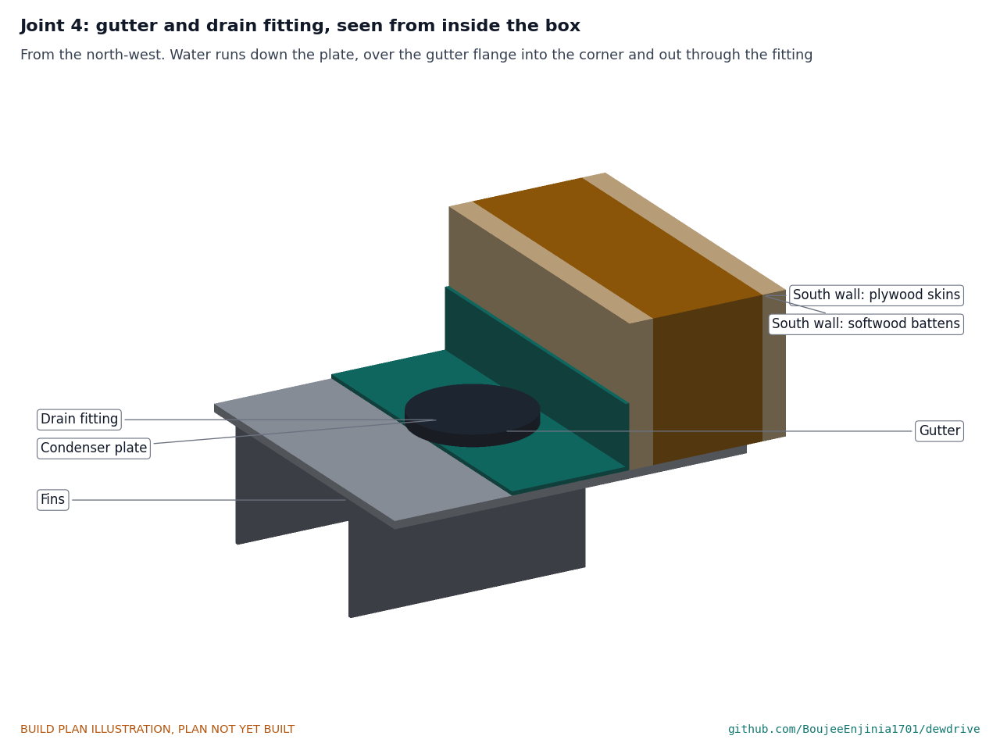

*Figure 10. Joint 4: water runs down the plate into the gutter corner and out through the fitting.*

The flange lies flat on the plate and the upstand against the south wall, both bedded in food-grade silicone, with the ends sealed to the east and west walls. Water running down the plate passes over the flange's 1 mm edge into the corner. The fitting goes down through the gutter and the plate with its sealing washer on top, nut underneath, between two fins.

**Check before moving on.** No light shows under the flange once bedded; the fitting's nut turns without touching a fin.

### 3.4 Wall ledges (make 2)

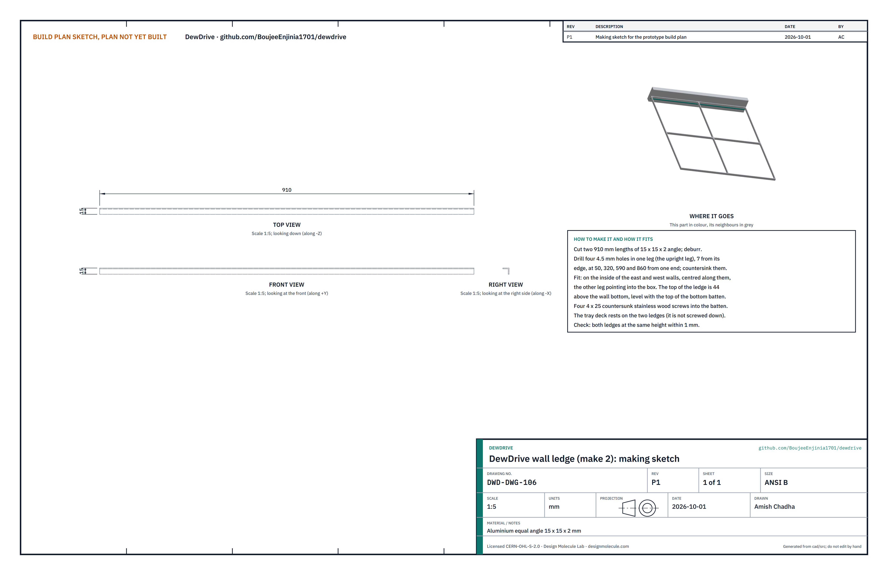

*Figure 11. Wall ledge (DWD-DWG-106).*

**What it is and what it is made from.** Two short shelves that carry the tray deck along the east and west walls. Aluminium equal angle 15 x 15 x 2.

**How to make it.**

1. Cut two 910 lengths and deburr.
2. Drill four 4.5 mm holes in one leg, 7 from its edge, at 50, 320, 590 and 860 from one end; countersink them.

**How it fits the parts next to it.** The drilled leg lies against the inside of the east (or west) wall, centred along it, with the other leg pointing into the box. The top of the ledge is 44 above the wall bottom, level with the top of the bottom batten; four 4 x 25 countersunk stainless wood screws go into the batten (Figure 14). The deck rests on the ledges and is not screwed down.

**Check before moving on.** Both ledges are level with each other within 1 mm.

### 3.5 Tray deck frame and sealing baffle

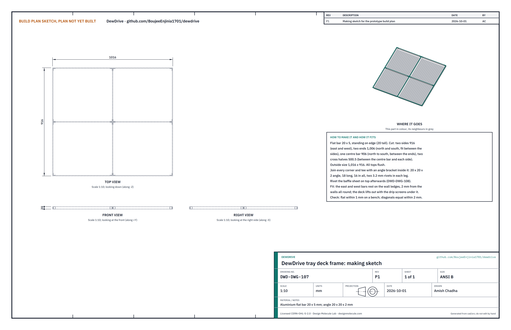

*Figure 12. Tray deck frame (DWD-DWG-107).*

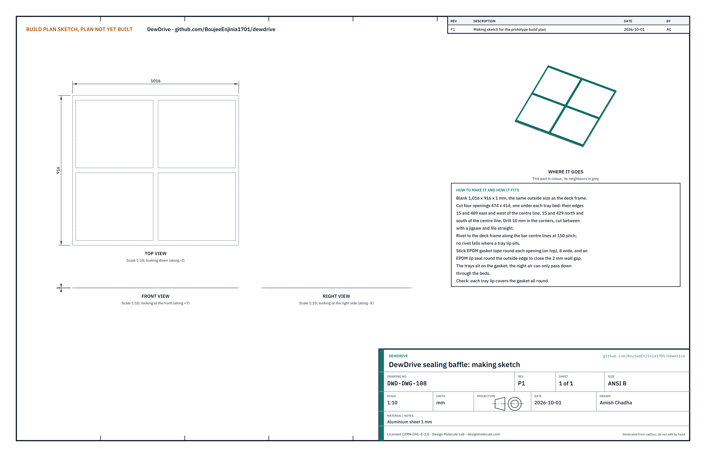

*Figure 13. Sealing baffle (DWD-DWG-108).*

**What it is and what it is made from.** A rigid tray that carries the four sorbent trays and seals the space above them from the space below, so the night air can only pass down through the beds. Frame: aluminium flat bar 20 x 5 on edge, joined with 16 small brackets of 20 x 20 x 2 angle. Baffle: aluminium sheet 1 mm.

**How to make it.**

1. Cut the bars: two sides 916 (east and west), two ends 1,006 (north and south, fitted between the sides), one centre bar 906 (north to south, between the ends) and two cross halves 500.5 (from the centre bar to each side). Outside size 1,016 x 916, all tops flush.
2. Cut 16 brackets 18 long from 20 x 20 x 2 angle. Clamp each joint square on a flat bench, put a bracket in its inside corner and rivet it with two 3.2 mm rivets in each leg.
3. Cut the baffle 1,016 x 916. Cut four openings 474 x 414, one under each tray bed: their edges 15 and 489 east and west of the centre line, 15 and 429 north and south of it. Drill 10 mm in the corners and cut between with a jigsaw.
4. Lay the baffle on the frame and rivet it along the bar centre lines at 150 pitch. No rivet falls where a tray lip sits.
5. Stick 8 mm EPDM gasket tape round each opening on top, and a self-adhesive EPDM lip seal round the baffle's outside edge.

**How it fits the parts next to it.**

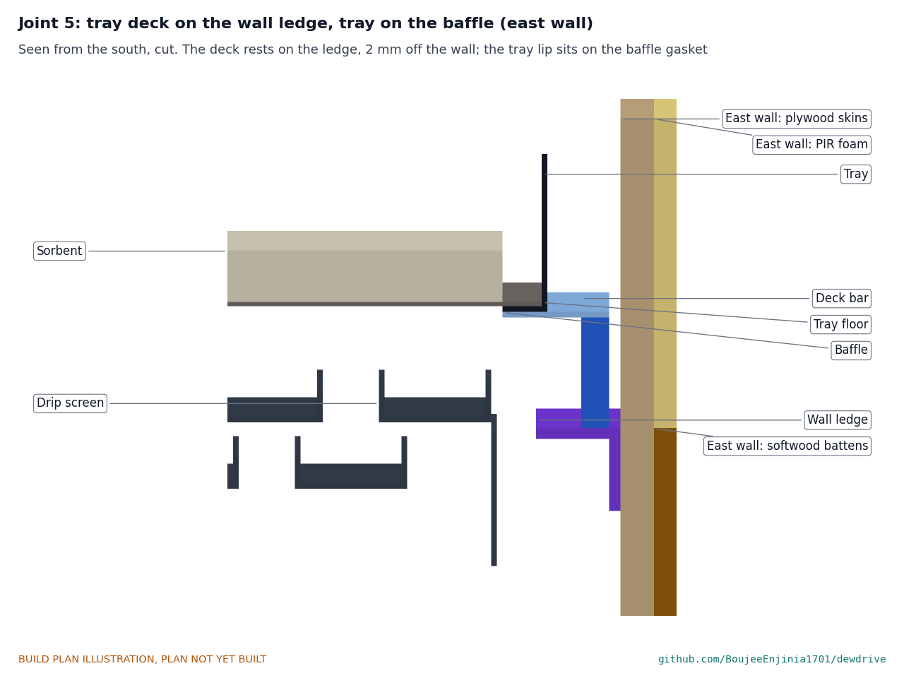

*Figure 14. The deck's side bar rests on the ledge, 2 mm off the wall; the tray lip sits on the gasket round its opening.*

The east and west bars rest on the ledges. The lip seal closes the 2 mm gap to the walls all round. The drip screens hang under the deck (section 3.6) and lift out with it.

**Check before moving on.** On a flat bench the deck rocks less than 1 mm; its diagonals are equal within 2 mm.

### 3.6 Drip screens (make 4)

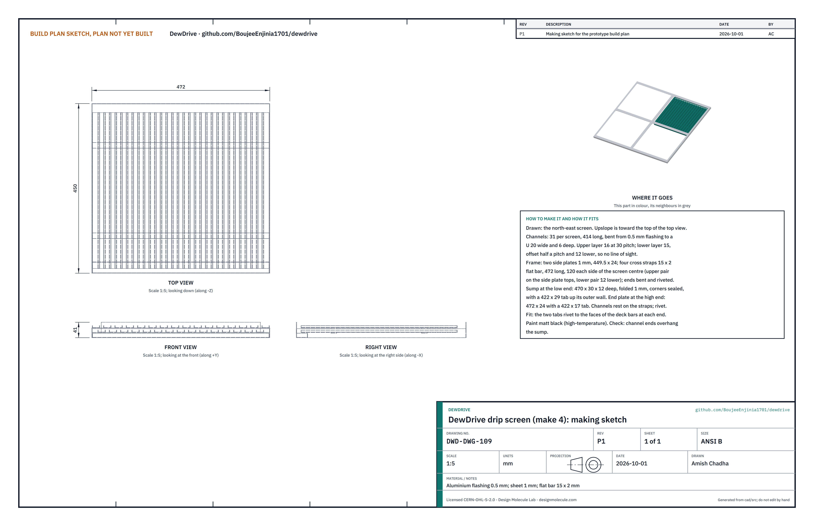

*Figure 15. Drip screen (DWD-DWG-109), the north-east one.*

**What it is and what it is made from.** A black louvre under each tray that catches any brine dripping from the bed and stops the hot bed radiating straight onto the condenser. Channels from 0.5 mm aluminium flashing; side plates, sump and end plate from 1 mm aluminium sheet; cross straps from 15 x 2 flat bar.

**How to make it.**

1. Bend 31 channels per screen from flashing, each 414 long, to a U 20 wide and 6 deep (a bending brake or two hardwood battens in a vice).
2. Cut two side plates 449.5 x 24 and four cross straps 472 long. Bend 10 at each strap end down 90°. Rivet the upper pair of straps on the side plate tops and the lower pair 12 lower between the plates, 120 each side of the screen's centre.
3. Fold the sump, 470 x 30 x 12 deep, with a tab 422 x 29 rising from its outer (low) wall; seal its corners with silicone. Fold the end plate, 472 x 24, with a tab 422 x 17. Rivet the sump between the side plates at the low end and the end plate at the high end.
4. Lay 16 channels on the upper straps at 30 pitch and 15 on the lower straps, offset half a pitch, all with their low ends over the sump; rivet each to its straps.
5. Paint the whole screen matt black with high-temperature paint.

**How it fits the parts next to it.**

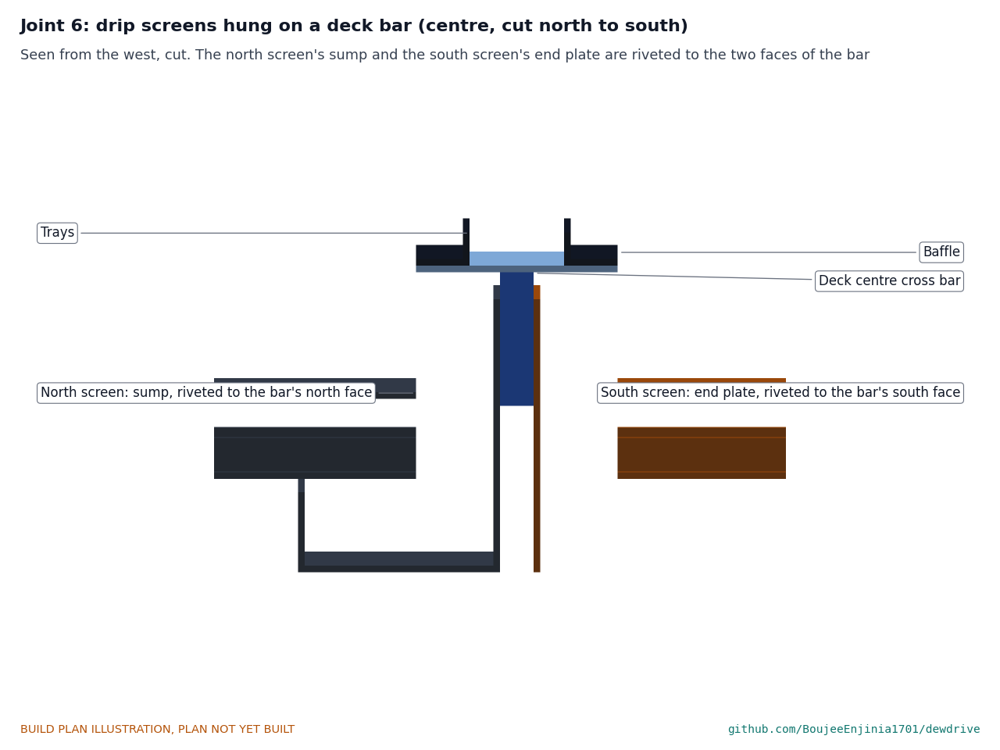

*Figure 16. The north screen's sump tab and the south screen's end plate tab are riveted to the two faces of the deck's cross bar.*

Each screen hangs under its opening by two tabs: the sump tab riveted to the face of the deck bar at its low (south) end, the end plate tab to the bar at its high end. Rivet them with the deck upside down on the bench (step 7). Nothing touches the condenser or the gutter: the sumps sit about 7 above the gutter's top edge.

**Check before moving on.** Looking straight down through each opening, no part of the floor below shows between the channels; every channel end overhangs its sump.

### 3.7 Sorbent trays (make 4)

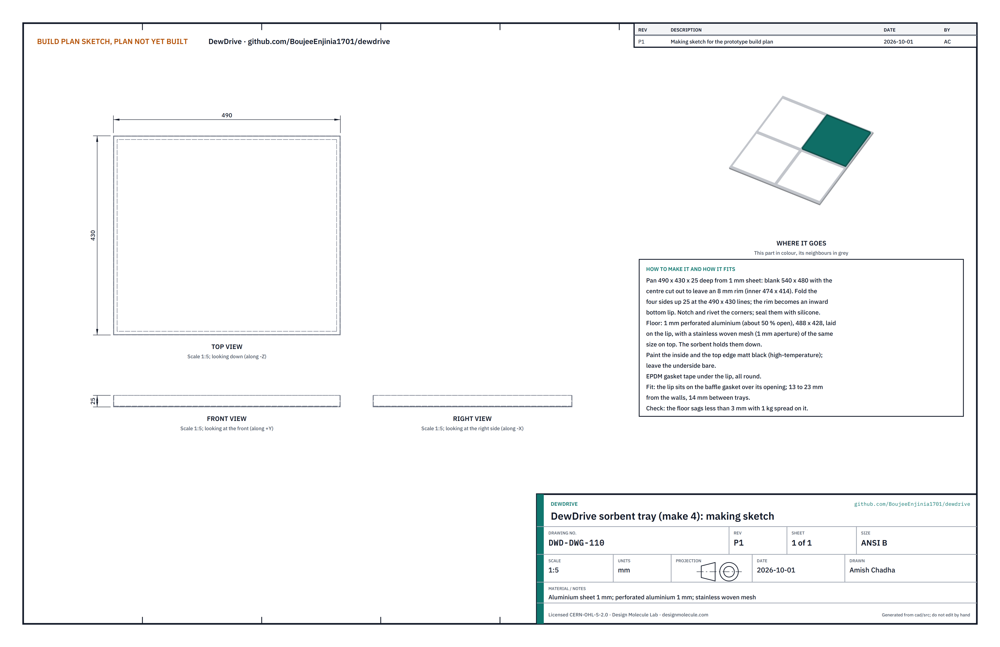

*Figure 17. Sorbent tray (DWD-DWG-110).*

**What it is and what it is made from.** Shallow black pans that hold the sorbent, with a floor that lets air through. Pan: aluminium sheet 1 mm. Floor: 1 mm perforated aluminium, about 50 % open, with a fine stainless woven mesh (1 mm aperture) on top.

**How to make it.**

1. Cut a blank 540 x 480 and cut out its centre to leave an 8 mm rim: inner 474 x 414.
2. Fold the four sides up 25 on the 490 x 430 lines; the rim becomes an inward bottom lip. Notch the corners, rivet the overlaps and seal them with silicone.
3. Paint the inside and the top edge matt black (high-temperature); leave the underside bare.
4. Cut the perforated sheet and the mesh 488 x 428 and lay them on the lip, mesh on top.
5. Stick EPDM gasket tape under the lip, all round.

**How it fits the parts next to it.** The tray's lip sits on the gasket round its opening in the baffle (Figure 14), 13 to 23 from the walls and 14 from the next tray. The tray is lifted out by its sides.

**Check before moving on.** With 1 kg spread on the floor, the floor sags less than 3 mm.

### 3.8 Composite sorbent

**What it is and what it is made from.** About 4 kg of silica gel beads holding calcium chloride in their pores: 3.0 kg of mesoporous silica gel beads (2 to 5 mm) and 1.0 kg of food-grade anhydrous calcium chloride, 25 % salt by mass. Figure 14 shows the bed in its tray.

**How to make it.**

1. Wear gloves and eye protection. Work in a plastic or stainless tub, outdoors or with good airflow.
2. Add the calcium chloride slowly to about 3 L of clean water, stirring; it gets hot. Let it cool.
3. Pour the cooled solution slowly over the gel while turning the beads, until the beads have taken it all up and no liquid stands in the tub. Cover and leave for 24 hours.
4. Dry the beads in thin layers at 120 to 150 °C (an oven, or the closed collector in sun) until they stop losing mass: they should then weigh about 4.0 kg.
5. Spread 1.0 kg evenly in each tray: about 9 mm deep.

**How it fits the parts next to it.** It lies loose on the tray's mesh floor.

**Check before moving on.** Total mass 4.0 kg, give or take 0.1 kg, after drying; no wet or caked beads.

### 3.9 Lid

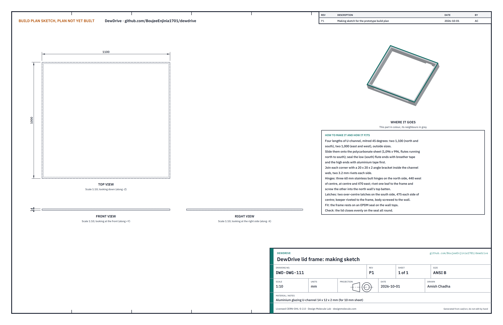

*Figure 18. Lid frame (DWD-DWG-111).*

**What it is and what it is made from.** The glazing: a 10 mm twin-wall polycarbonate sheet, 1,096 x 996, rated 130 °C or more, held in an aluminium glazing U-channel frame (14 x 12 x 2, for 10 mm sheet).

**How to make it.**

1. Cut the four channel lengths with 45° mitres: two 1,100 and two 1,000 (outside sizes).
2. Tape the sheet's flute ends: breather tape on the low (south) edge, aluminium tape on the high (north) edge. The flutes run north to south.
3. Slide the channels onto the sheet. Join each corner with a 20 x 20 x 2 angle bracket inside the channel web, two 3.2 mm rivets each side.
4. Rivet one leaf of each of three 60 mm stainless butt hinges to the north side of the frame, 440 west of centre, at centre and 470 east. Rivet the keepers of two over-centre latches to the south side, 475 each side of centre.

**How it fits the parts next to it.**

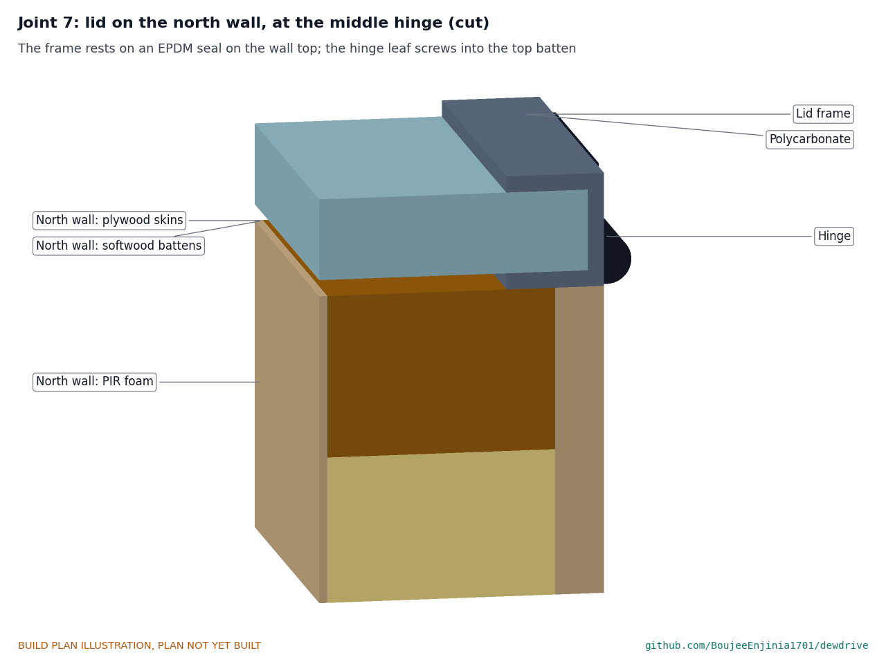

*Figure 19. The frame rests on an EPDM seal on the wall top; the hinge leaf screws into the top batten.*

The frame rests on a self-adhesive EPDM seal along the wall tops. The hinges' other leaves screw into the north wall's top batten; the latch bodies screw to the south wall. The fan hood sits between two hinges (Figure 22).

**Check before moving on.** Latched, the lid presses evenly on the seal all round; a strip of paper is gripped everywhere.

### 3.10 Inlet flap

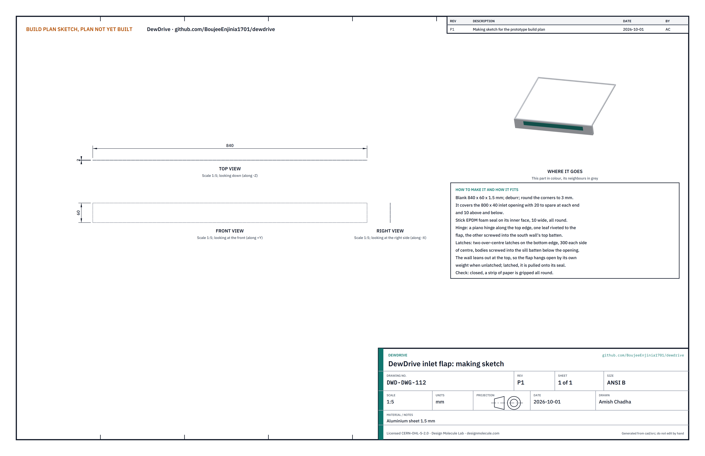

*Figure 20. Inlet flap (DWD-DWG-112).*

**What it is and what it is made from.** The flap that closes the inlet opening by day. Aluminium sheet 1.5 mm, 840 x 60.

**How to make it.**

1. Cut the blank, deburr and round the corners to 3.
2. Stick 10 mm EPDM foam seal on its inner face, all round.
3. Rivet one leaf of an 840 mm piano hinge along the top edge.

**How it fits the parts next to it.**

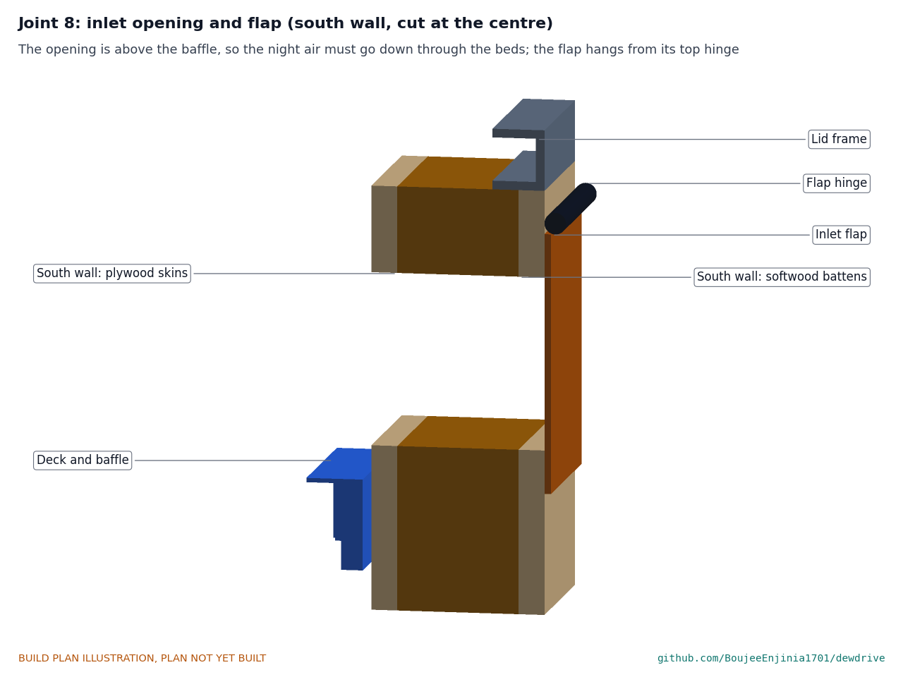

*Figure 21. The opening is above the deck, so the night air must go down through the beds; the flap hangs from its top hinge.*

The hinge's other leaf screws into the south wall's top batten, so the flap covers the opening with 20 to spare at each end and 10 above and below. Two over-centre latches at its bottom edge, 300 each side of centre, have their bodies screwed into the sill batten. The wall leans out at the top, so the flap hangs open by its own weight when unlatched.

**Check before moving on.** Latched, a strip of paper is gripped all round the seal.

### 3.11 Fan hood and outlet flap

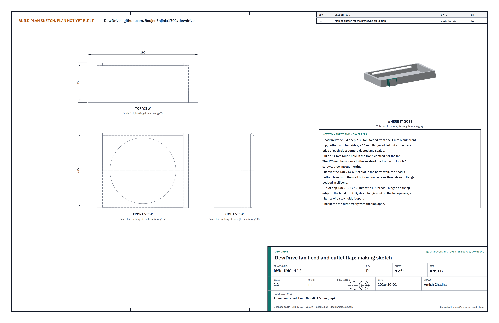

*Figure 22. Fan hood and outlet flap (DWD-DWG-113).*

**What it is and what it is made from.** A sheet-metal box on the outside of the north wall over the outlet slot. It holds the night fan; a flap closes the fan opening by day. Hood: aluminium sheet 1 mm. Flap: aluminium sheet 1.5 mm, 140 x 125.

**How to make it.**

1. Fold the hood from one blank: front, top, bottom and two sides, 160 wide, 64 deep and 130 tall, with a 15 mm flange folded out at the back edge of each side. Rivet and seal the corners.
2. Cut a 114 mm round hole in the front, centred.
3. Screw the 120 mm fan to the inside of the front with four M4 screws, blowing outward.
4. Stick EPDM seal round the flap's inner face and fit a small hinge along its top edge, riveted to the hood front above the hole. Fit a wire stay to hold it open at night and a turn button to hold it shut by day.

**How it fits the parts next to it.**

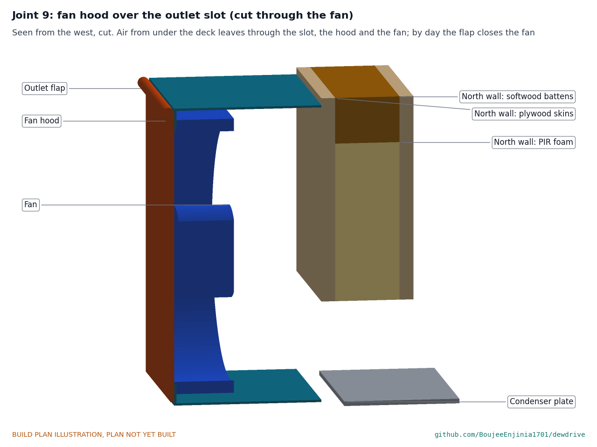

*Figure 23. Air from under the deck leaves through the slot, the hood and the fan.*

The hood covers the 140 x 44 slot, its bottom level with the wall bottom, with four screws through each flange into the wall, bedded in silicone. The fan lead goes through a cable gland in the hood's bottom.

**Check before moving on.** The fan turns freely with the flap open, and the flap closes flat on its seal.

### 3.12 Stand rails (make 2)

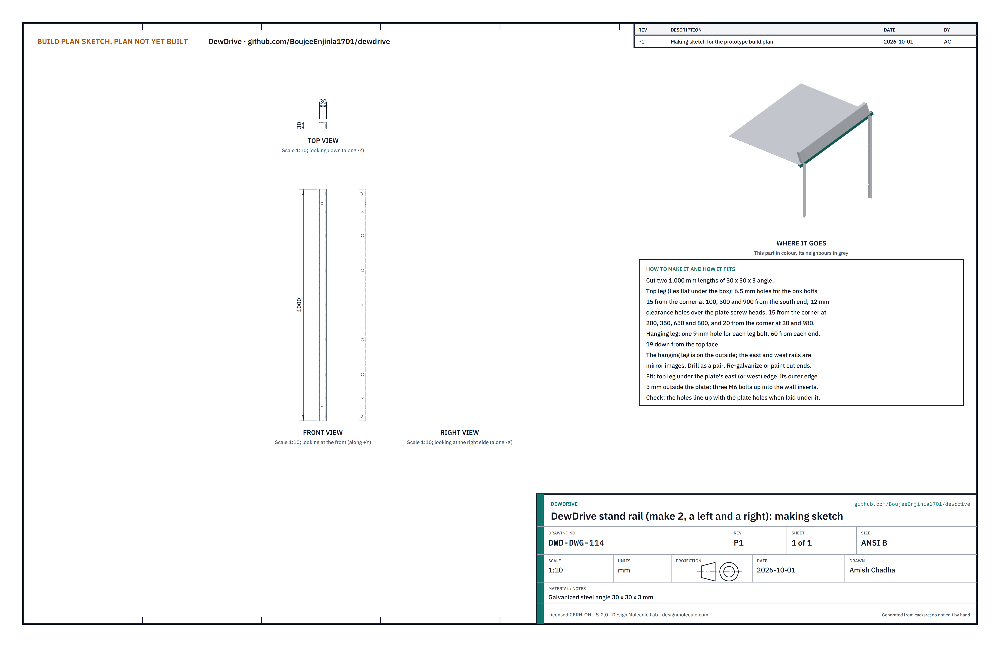

*Figure 24. Stand rail (DWD-DWG-114).*

**What it is and what it is made from.** The two rails the box sits on, one under each of its east and west edges. Galvanized steel angle 30 x 30 x 3, 1,000 long.

**How to make it.**

1. Cut two lengths; they are mirror images, so drill them clamped as a pair.
2. Top leg: three 6.5 mm holes, 15 from the corner, at 100, 500 and 900 from the south end; and 12 mm clearance holes over the plate screw heads, 15 from the corner at 200, 350, 650 and 800, and 20 from the corner at 20 and 980.
3. Hanging leg: one 9 mm hole 60 from each end, 19 down from the top face.
4. Paint the cut ends and holes with zinc-rich paint.

**How it fits the parts next to it.**

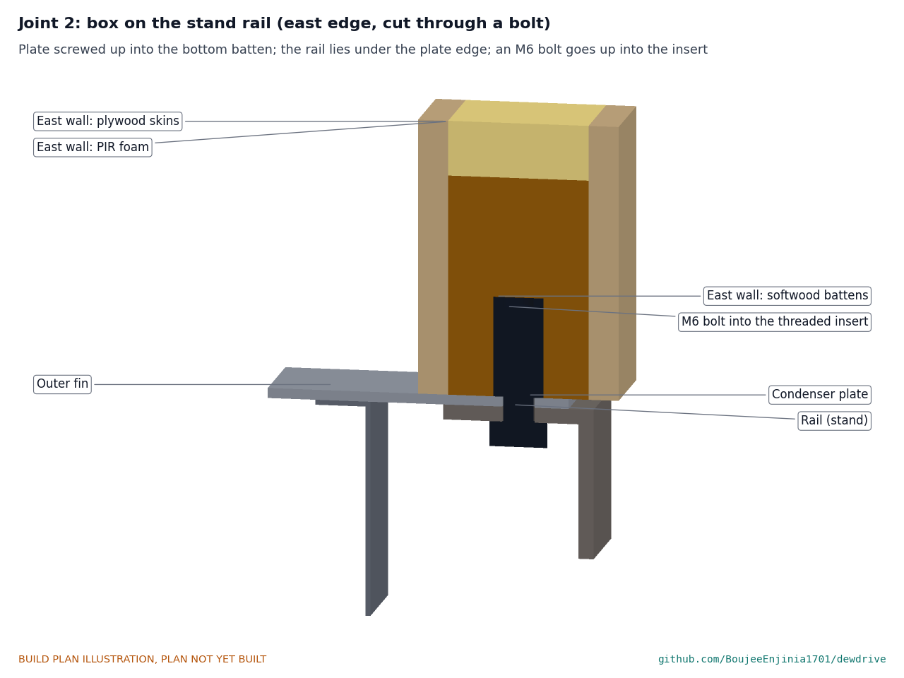

*Figure 25. The rail lies under the plate edge; an M6 bolt goes up through the rail and the plate into the threaded insert.*

The top leg lies under the plate's east (or west) edge with the hanging leg outside, its outer face 5 outside the plate edge. Three M6 x 40 bolts go up into the wall inserts; the plate screw heads sit in the clearance holes.

**Check before moving on.** Laid under the plate, every rail hole lines up with its plate hole or screw head.

### 3.13 Legs (make 4: two south, two north)

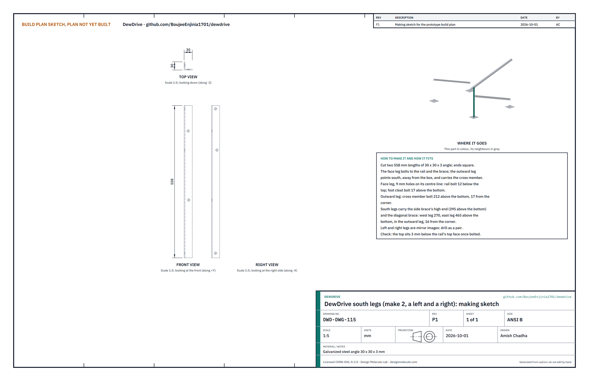

*Figure 26. South legs (DWD-DWG-115).*

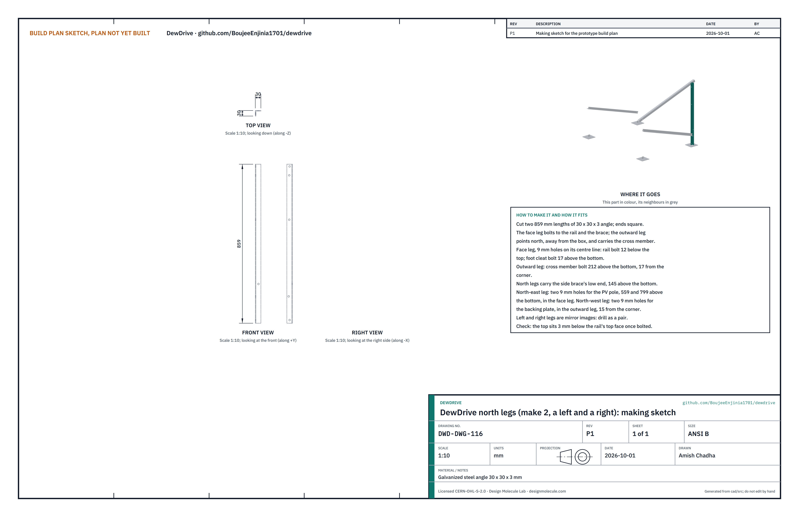

*Figure 27. North legs (DWD-DWG-116).*

**What it is and what it is made from.** The four legs, short at the south and tall at the north, which give the 20° tilt. Galvanized steel angle 30 x 30 x 3: south legs 558, north legs 859.

**How to make it.**

1. Cut the four lengths with square ends. Each leg has a face leg (it bolts to the rail and the side brace) and an outward leg (it points away from the box and carries the cross member).
2. All legs, 9 mm holes: face leg, on its centre line, 12 below the top (rail bolt) and 17 above the bottom (foot cleat); outward leg, 212 above the bottom and 17 from the corner (cross member).
3. South legs: a hole in the face leg 395 above the bottom (side brace); in the outward leg, 16 from the corner, the west leg at 270 and the east leg at 465 above the bottom (diagonal brace).
4. North legs: a hole in the face leg 145 above the bottom (side brace). North-east leg: two more in the face leg, 559 and 799 above the bottom (PV pole). North-west leg: two more in the outward leg, 15 from the corner (backing plate), as DWD-DWG-122 gives.
5. Left and right legs are mirror images; drill them as pairs. Paint the holes and cut ends.

**How it fits the parts next to it.**

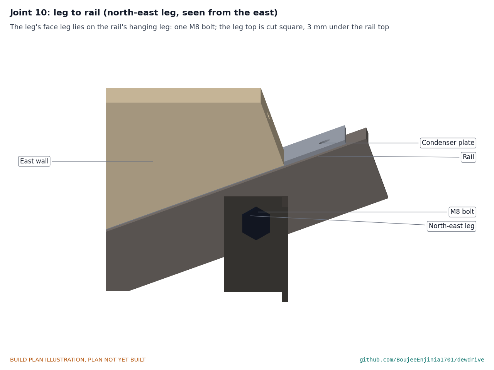

*Figure 28. The leg's face leg lies on the rail's hanging leg, held by one M8 bolt; its top is 3 below the rail's top face.*

**Check before moving on.** Bolted to its rail, each leg's top is 2 to 4 below the rail's top face and the leg stands square to the rail's line.

### 3.14 Foot plates and cleats (make 4)

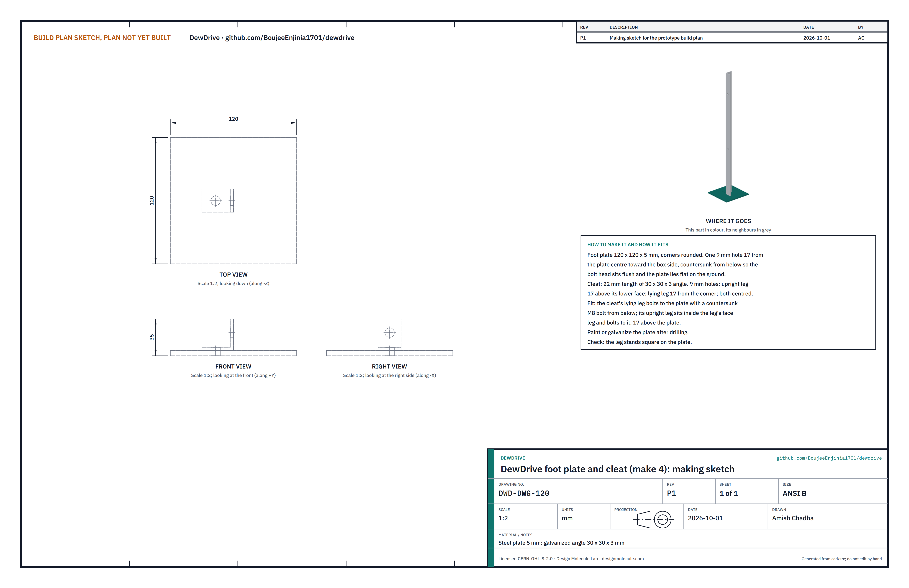

*Figure 29. Foot plate and cleat (DWD-DWG-120).*

**What it is and what it is made from.** A flat foot under each leg. Steel plate 5 mm, 120 x 120; cleat from galvanized angle 30 x 30 x 3, 22 long.

**How to make it.**

1. Cut the plates and round the corners. Drill one 9 mm hole 17 from the plate centre toward the box side and countersink it from below.
2. Cut the cleats. Drill 9 mm in each leg: the upright leg 17 above its lower face, the lying leg 17 from the corner, both centred.
3. Paint the plates with zinc-rich paint.

**How it fits the parts next to it.**

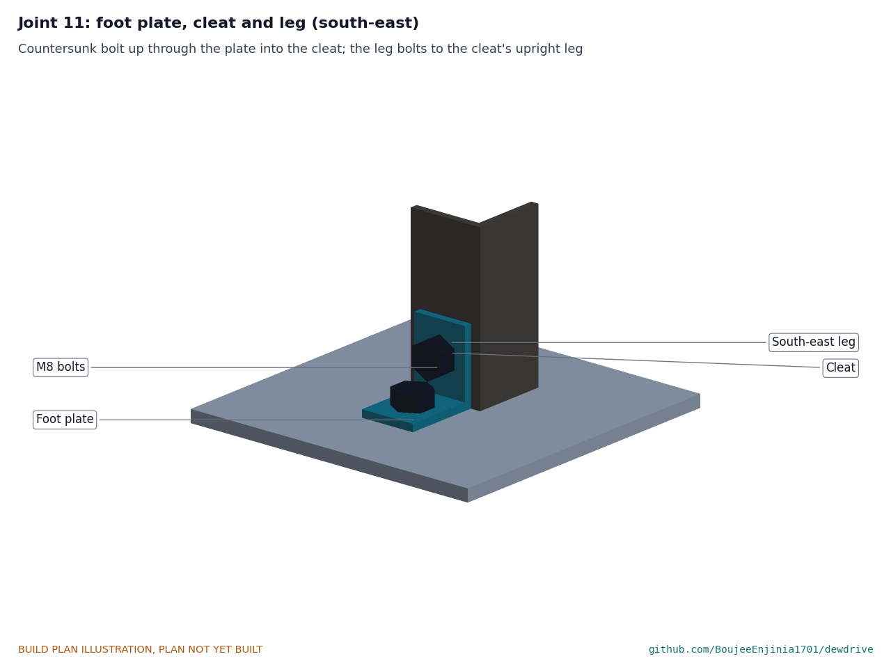

*Figure 30. A countersunk M8 bolt comes up through the plate into the cleat; the leg bolts to the cleat's upright leg.*

**Check before moving on.** The plate lies flat on a bench with the bolt in place; the leg stands square on it.

### 3.15 Side braces (make 2)

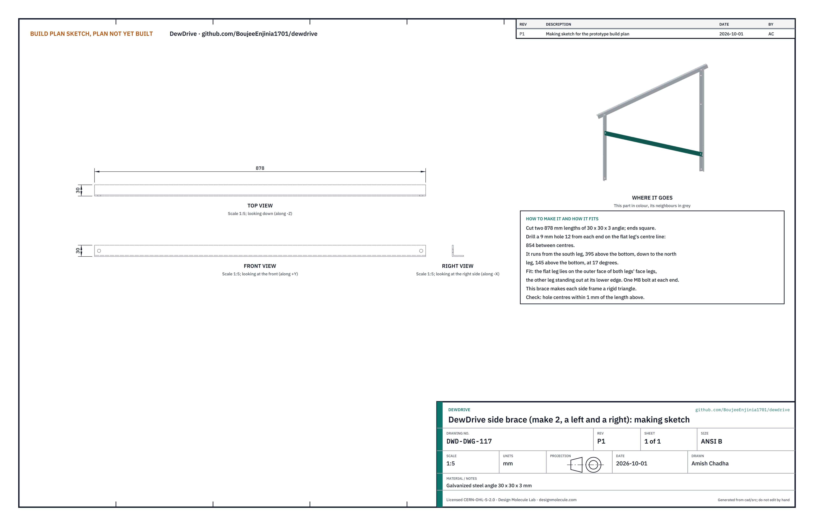

*Figure 31. Side brace (DWD-DWG-117).*

**What it is and what it is made from.** The diagonal in each side frame, from high on the south leg to low on the north leg, which makes the side frame a rigid triangle. Galvanized steel angle 30 x 30 x 3, 878 long.

**How to make it.** Cut two lengths with square ends. Drill a 9 mm hole 12 from each end on the flat leg's centre line, 854 between centres. Drill as a pair; paint the ends.

**How it fits the parts next to it.**

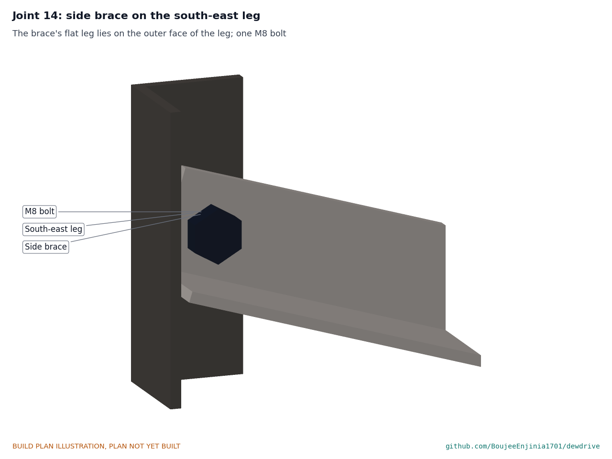

*Figure 32. The brace's flat leg lies on the outer face of the leg; one M8 bolt.*

The flat leg lies on the outer faces of both legs' face legs, its other leg standing out at the lower edge, and runs down at 17° from the south leg to the north leg.

**Check before moving on.** Hole centres within 1 of 854.

### 3.16 Cross members and south diagonal brace

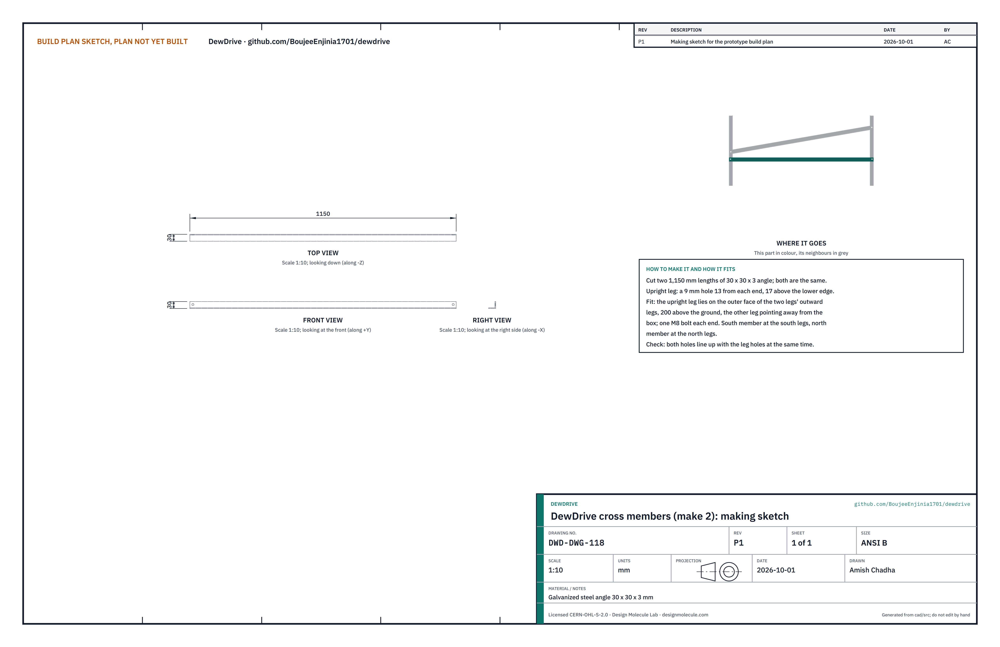

*Figure 33. Cross members (DWD-DWG-118).*

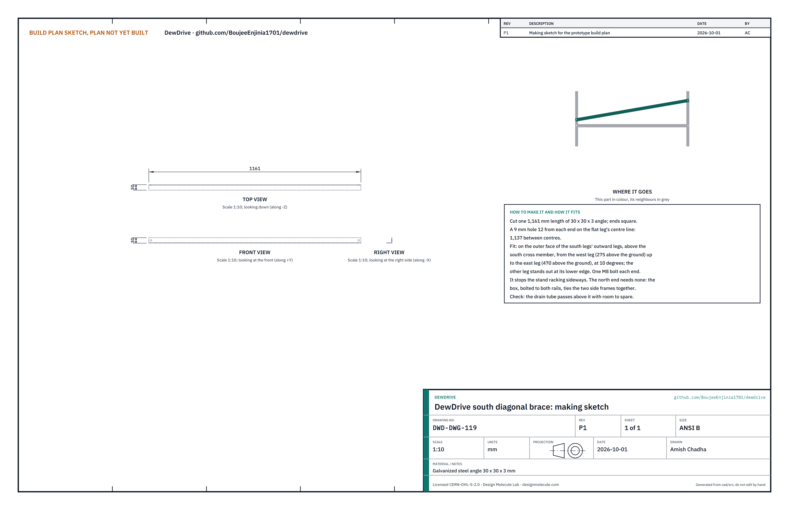

*Figure 34. South diagonal brace (DWD-DWG-119).*

**What it is and what it is made from.** Two cross members that tie the legs together at each end, 200 above the ground, and one diagonal across the south end that stops the stand swaying sideways. Galvanized steel angle 30 x 30 x 3: cross members 1,150, diagonal 1,161.

**How to make it.**

1. Cross members: cut two lengths; drill a 9 mm hole 13 from each end, 17 above the lower edge of the upright leg.
2. Diagonal: cut one length; drill a 9 mm hole 12 from each end on the flat leg's centre line, 1,137 between centres.
3. Paint the ends and holes.

**How it fits the parts next to it.**

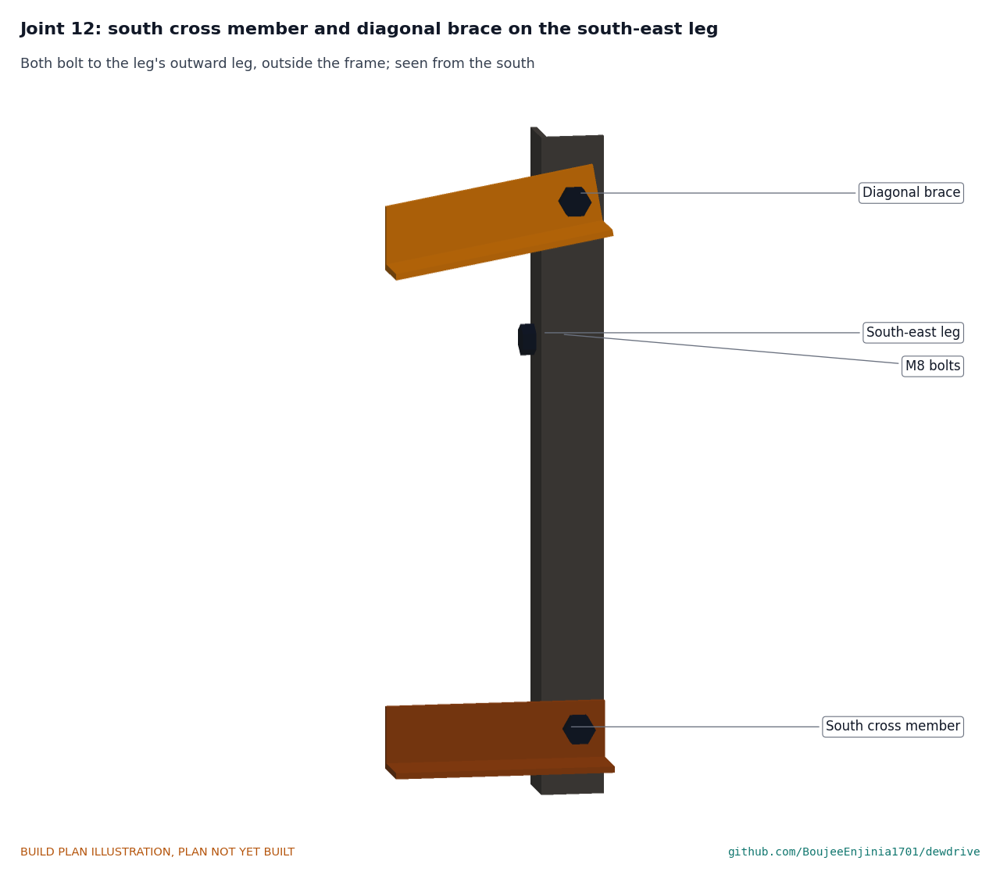

*Figure 35. Both bolt to the outer face of the leg's outward leg.*

Each cross member's upright leg lies on the outer faces of the two legs' outward legs, its other leg pointing away from the box, one M8 bolt each end. The diagonal lies in the same plane above the south cross member, from the west leg 275 above the ground to the east leg 470 above the ground. The north end needs no diagonal: the box, bolted to both rails, ties the side frames together.

**Check before moving on.** All holes line up with the leg holes at the same time with the rails level.

### 3.17 PV pole

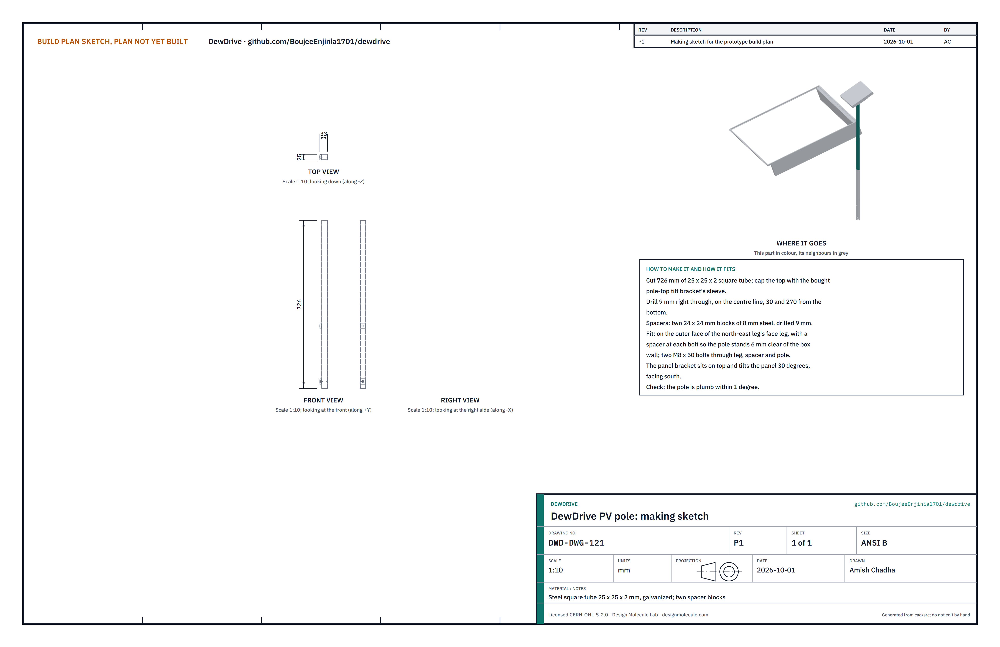

*Figure 36. PV pole (DWD-DWG-121).*

**What it is and what it is made from.** The pole that holds the 10 W panel above the north-east leg, north of the box where it cannot shade it. Steel square tube 25 x 25 x 2, galvanized, 726 long; two spacer blocks 24 x 24 x 8 steel.

**How to make it.**

1. Cut the tube; drill 9 mm right through, on the centre line, 30 and 270 from the bottom.
2. Cut and drill the two spacers 9 mm.

**How it fits the parts next to it.**

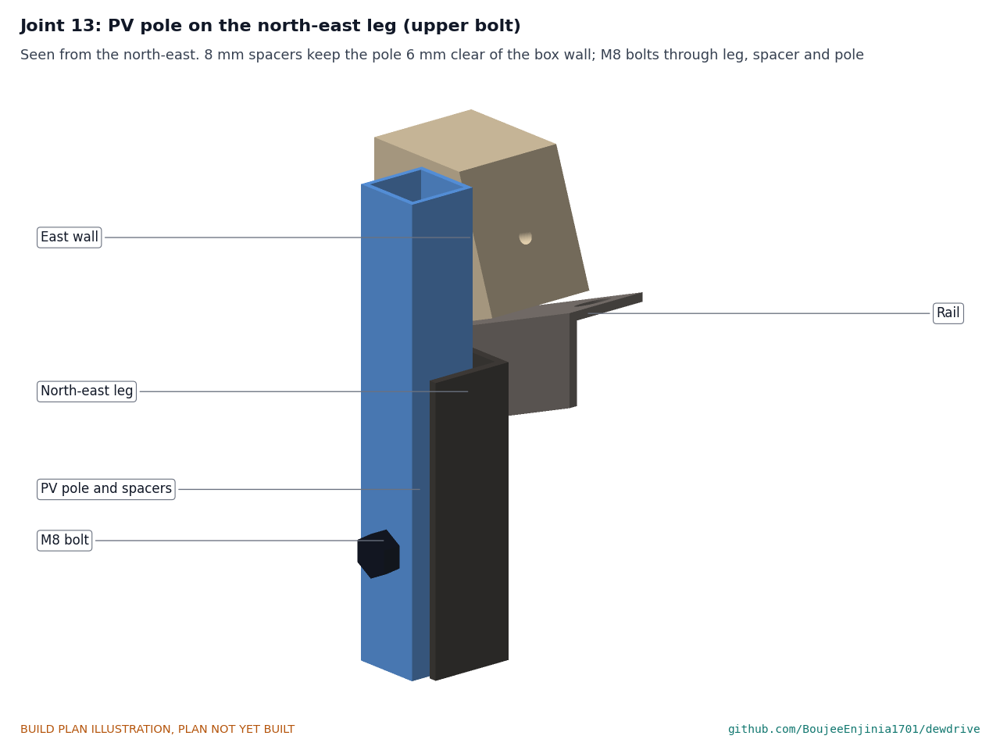

*Figure 37. The spacers keep the pole 6 clear of the box wall.*

Two M8 x 50 bolts go through the leg's face leg, a spacer and the pole. The bought pole-top bracket sleeves over the top of the pole and tilts the panel 30° to the south.

**Check before moving on.** The pole is plumb within 1° and clears the box by at least 5.

### 3.18 Electronics backing plate and wiring

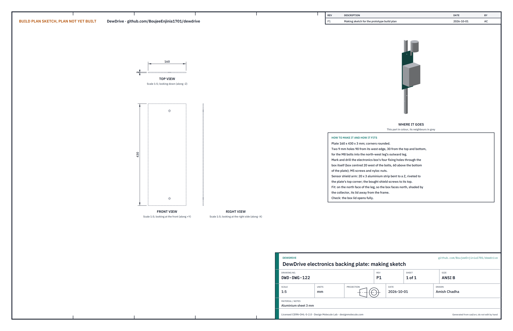

*Figure 38. Electronics backing plate (DWD-DWG-122).*

**What it is and what it is made from.** A plate on the north face of the north-west leg that carries the electronics box and, on a small arm, the air sensor's radiation shield. Aluminium sheet 3 mm, 160 x 430; arm from 20 x 3 aluminium strip.

**How to make it.**

1. Cut the plate and round the corners. Drill two 9 mm holes 90 from its west edge, 30 from the top and from the bottom.
2. Hold the electronics box on the plate, centred 20 west of the bolt line and 60 above the plate's bottom; drill through its fixing holes and fix it with M5 screws and nyloc nuts.
3. Bend the arm to a Z and rivet it to the plate's top corner; the bought shield screws to its top.

**How it fits the parts next to it.** Two M8 bolts through the plate and the leg's outward leg. The box faces north, in the collector's shade, with its lid away from the frame.

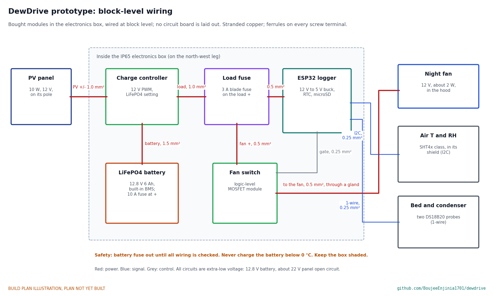

*Figure 39. Block-level wiring with wire sizes. Bought modules; no circuit board is laid out.*

Wire it like this, with stranded copper and a ferrule on every screw terminal, the battery fuse out:

1. PV panel to the charge controller's panel input: 1.0 mm² (18 AWG), through a cable gland in the box bottom.
2. Charge controller to the battery, through the 10 A fuse at the battery's positive terminal: 1.5 mm² (16 AWG).
3. Controller load output, through a 3 A fuse, to the logger's 12 V to 5 V converter: 1.0 mm² then 0.5 mm² (20 AWG).
4. Load fuse to the fan switch module, and the switch to the fan: 0.5 mm², through a gland in the box and one in the hood.
5. Logger output pin to the switch module's input: 0.25 mm² (24 AWG).
6. Air temperature and humidity sensor to the logger (I2C) and the two probes (one taped under a tray, one on the condenser plate) to the logger (1-wire): 0.25 mm², twisted, cable-tied along the frame.

The logger needs firmware, which is TRL 4 work; for the first checks the fan is switched by hand from the bench (section 5).

**Check before moving on.** With the battery fuse out, every wire continues end to end and nothing reads short to the negative rail.

### 3.19 Bought components

Buy to specification, not brand. Line numbers are those of the bill of materials.

- **Glazing sheet (line 3).** 10 mm UV-stabilized twin-wall polycarbonate, 1,096 x 996, rated 130 °C or more (a 120 °C sheet only if the supplier's data and the inner-skin temperature measured at the first stagnation test both show it stays inside its rating), with breather and aluminium flute tape, EPDM seal, three 60 mm stainless butt hinges and two over-centre latches.
- **Tray floors (line 4).** 1 mm perforated aluminium, about 50 % open; stainless woven mesh, 1 mm aperture; EPDM gasket tape.
- **Silica gel and salt (line 5).** Mesoporous silica gel beads, 2 to 5 mm, about 1.0 cm³/g pore volume; food-grade anhydrous calcium chloride (E509).
- **Drain (line 7).** Food-grade bulkhead fitting with a 12 mm hose barb, for a 17 mm hole; 1 m of food-grade silicone tube, 12 mm bore.
- **Bottle (line 8).** 10 L food-grade HDPE jerrycan with a screw cap; fit a grommet in the cap for the tube.
- **Flap hardware (line 9).** 840 mm piano hinge; two small over-centre latches; EPDM foam seal.
- **Fan (line 10).** 12 V, 120 mm, about 2 W, IP55.
- **PV (line 11).** 10 W 12 V monocrystalline panel, about 340 x 250; pole-top tilt bracket for a 25 mm square pole.
- **Electronics (line 12).** IP65 box about 160 x 110 x 220; 12 V PWM solar charge controller with a LiFePO4 setting; 12.8 V 6 Ah LiFePO4 battery with built-in battery management and a 10 A inline fuse; ESP32 logger board with clock and microSD; 12 V to 5 V converter; logic-level MOSFET switch module; 3 A blade fuse; cable glands.
- **Sensors (line 13).** SHT4x-class air temperature and humidity sensor with a radiation shield; two waterproof DS18B20 probes.
- **Anchors (line 1).** Two auger ground anchors rated for 100 N or more of uplift in the site's soil, with two ratchet straps.
- **Fixings (line 14).** About 22 galvanized M8 bolts (25 to 50 long) with nuts and washers, and four countersunk M8 bolts for the feet; six M6 x 40 bolts and six M6 threaded inserts for wood; 24 M5 x 30 stainless button-head screws; 12 stainless 5 x 65 wood screws; 8 stainless 4 x 25 countersunk screws; 3.2 mm aluminium rivets (closed-end for the fins); food-grade silicone; polyurethane construction adhesive; high-temperature epoxy; EPDM gasket tape and lip seal; cable glands and ties.

## 4. Putting it together

In each picture the parts already fitted are grey and the parts being fitted are in colour, with an arrow showing the way they go in. Steps 1 to 12 are on the bench, with the box lying flat; steps 13 to 19 are at the site.

### Step 1: join the wall panels into a box

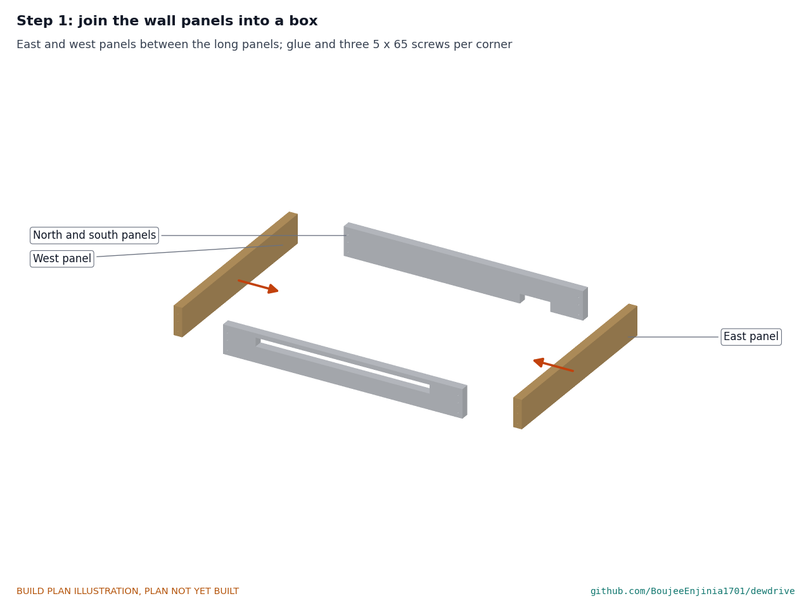

Glue each corner and drive three 5 x 65 screws through the long panel into the short panel's end post. Check the diagonals before the glue sets.

### Step 2: fins onto the condenser plate

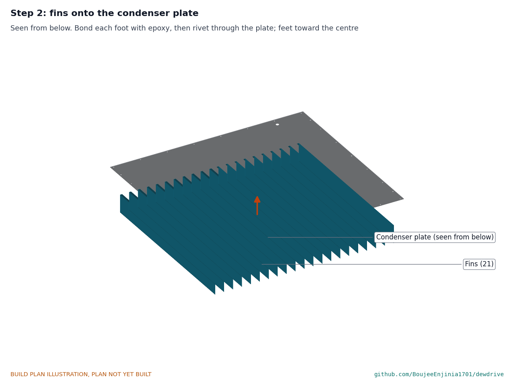

Plate top face down. Bond and rivet each fin as section 3.2 says. **Hold point:** the epoxy is fully cured before the plate is turned over.

### Step 3: box onto the plate

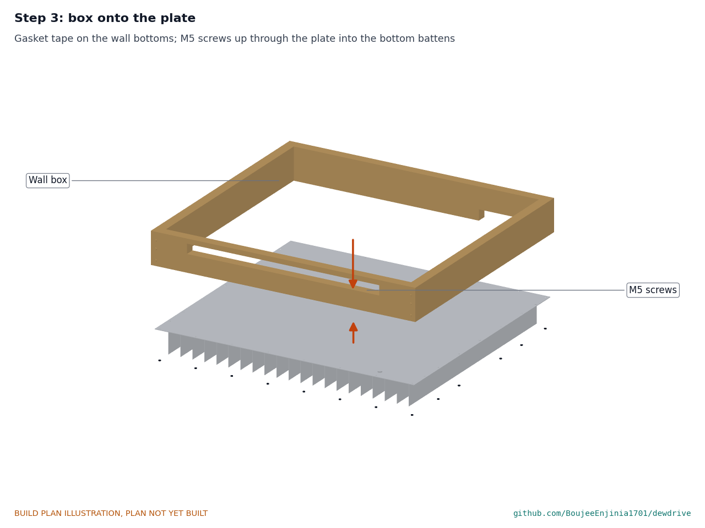

EPDM gasket tape on the wall bottoms. Set the box on the plate, edges 10 inside the walls' outer faces all round, and drive the 24 M5 screws up through the plate into the bottom battens. Then coat the plate's top face (section 3.2, item 5).

### Step 4: gutter and drain fitting

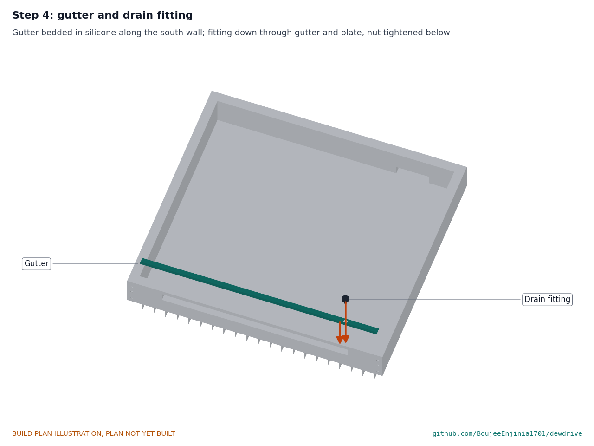

Bed the gutter in silicone along the south wall; fit the drain fitting down through the gutter and the plate, washer on top, nut below.

### Step 5: wall ledges

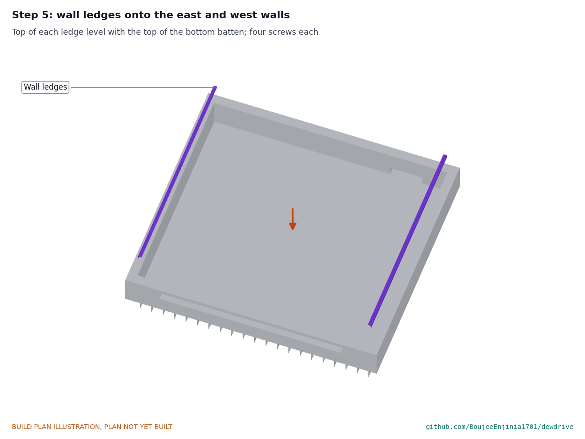

Screw a ledge to the inside of the east and west walls, its top level with the top of the bottom batten.

### Step 6: baffle onto the deck frame

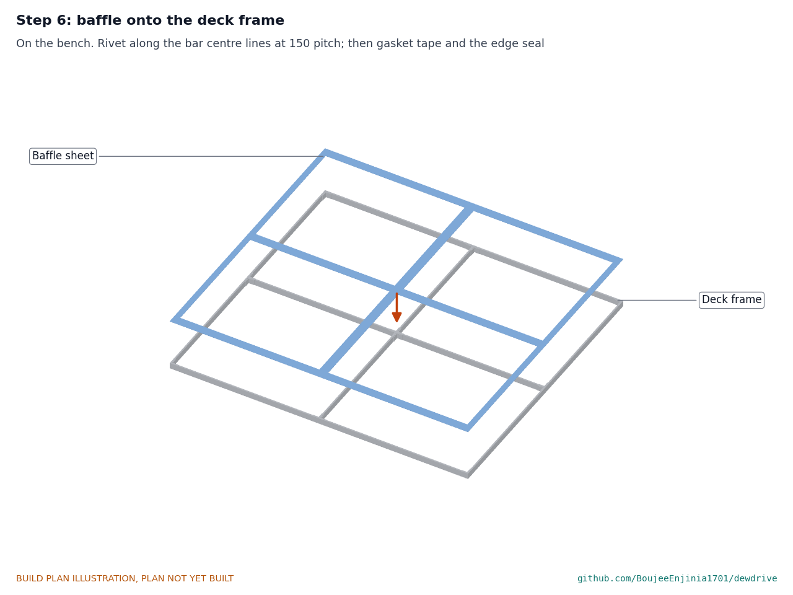

On the bench: rivet the baffle to the frame, then stick the gasket tape round the openings and the lip seal round the edge.

### Step 7: drip screens under the deck

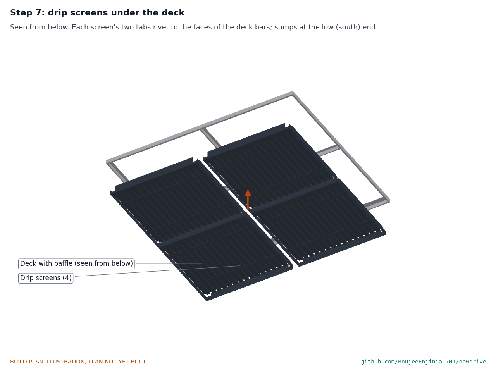

Turn the deck upside down. Rivet each screen's sump tab and end plate tab to the faces of the deck bars, sumps toward the south (low) edge.

### Step 8: deck into the box

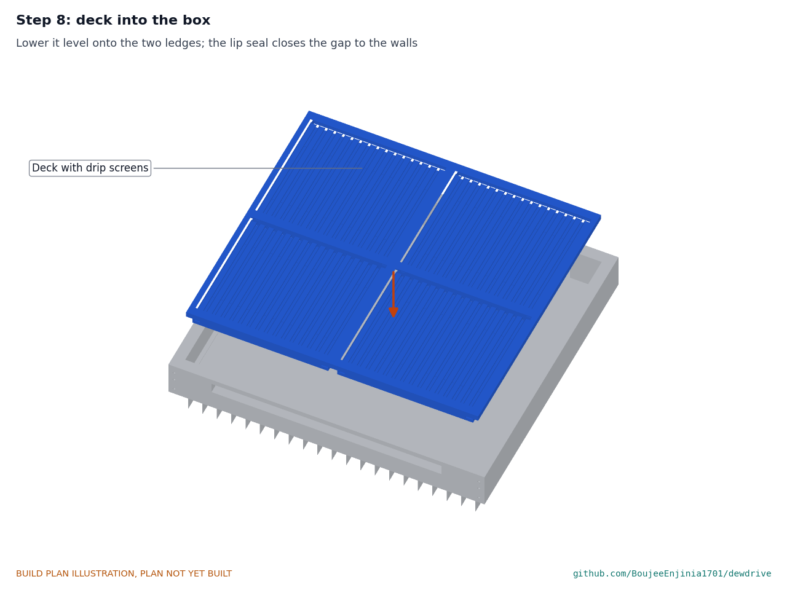

Lower the deck, screens down, level onto the two ledges. The lip seal should touch the walls all round.

### Step 9: trays onto the deck

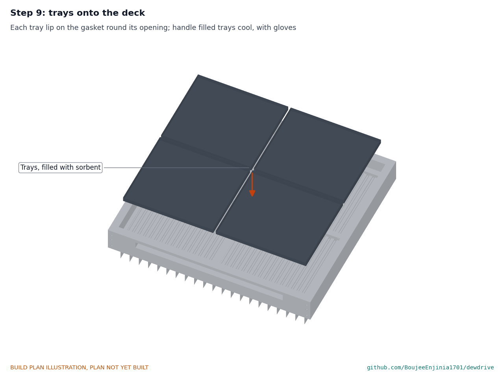

Fill each tray with 1.0 kg of dry sorbent (section 3.8) and set it on the gasket round its opening. **Hold point:** wear gloves; trays that have been in sun are hot.

### Step 10: the lid

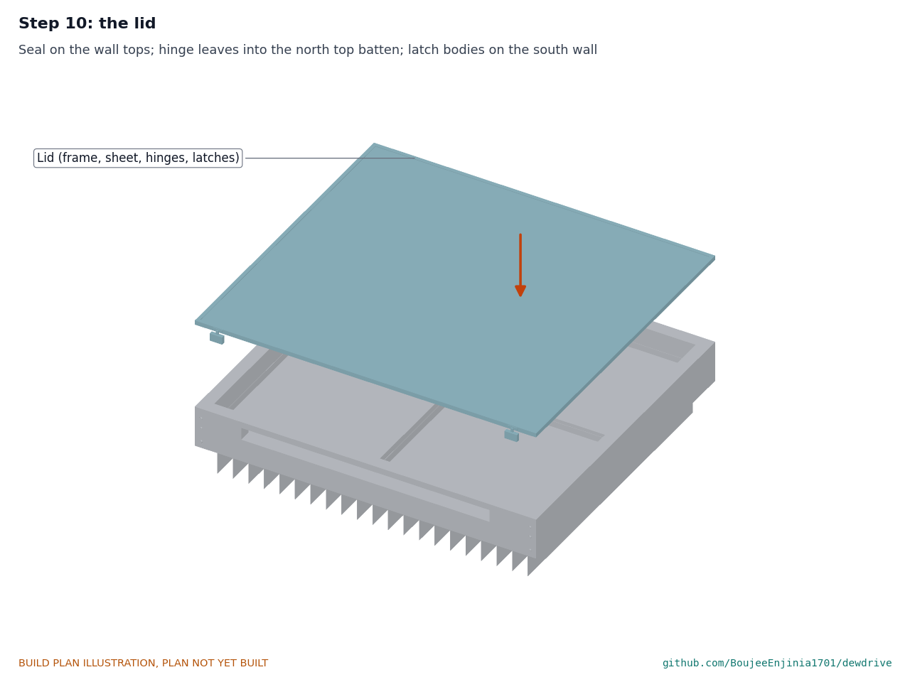

Stick the EPDM seal on the wall tops. Set the lid on, screw the hinge leaves into the north wall's top batten and the latch bodies to the south wall.

### Step 11: inlet flap

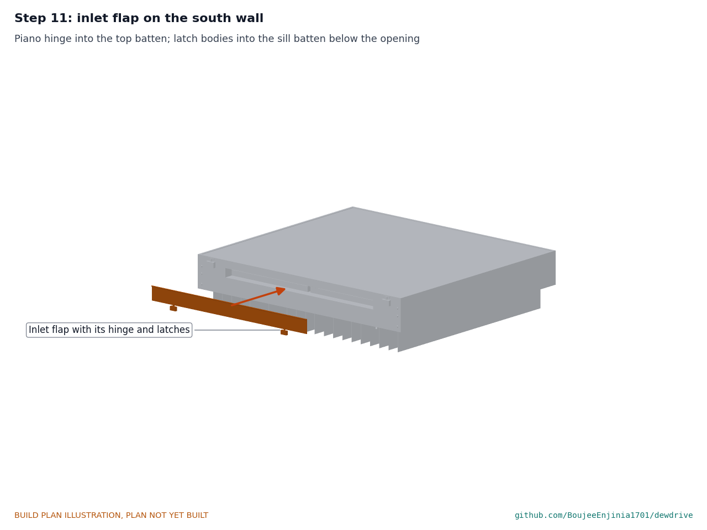

Screw the piano hinge's free leaf into the south wall's top batten and the latch bodies into the sill batten.

### Step 12: fan, hood and outlet flap


With the fan already in the hood, screw the hood over the outlet slot through its flanges, bedded in silicone. Pass the fan lead through the gland in the hood's bottom.

### Step 13: the two side frames


At the site, on level ground. Bolt the cleats to the foot plates and the legs to the cleats. On the ground, bolt each side frame together: south leg, north leg, rail and side brace. Stand them up with the rails' outer faces 1,090 apart.

### Step 14: cross members and diagonal brace


Bolt both cross members, then the diagonal. Check that the two rails are level with each other and square to the cross members, then tighten every bolt.

### Step 15: ground anchors


Screw each anchor in 190 outside a south leg and strap it to the leg with a ratchet strap. **Hold point:** safety stop S4.

### Step 16: box onto the stand


Two people, with the trays and the deck taken out of the box first, as the label on the box says. Lower the box onto the rails so the rail holes line up with the inserts, and drive the six M6 bolts up into the inserts. Then put the deck and trays back.

### Step 17: PV pole and panel


Bolt the pole to the north-east leg on its spacers. Fit the bracket and the panel, tilted 30° to the south.

### Step 18: electronics and sensor shield


Bolt the backing plate to the north-west leg. Fit the box, the sensor shield and the probes; run the cables along the frame with ties and wire them as Figure 39. **Hold point:** safety stop S5.

### Step 19: bottle and drain tube


Push the tube onto the fitting's barb and run it down over the diagonal brace to the bottle, through the grommet in its cap.

## 5. First checks

These are the checks a TRL 4 test report would record; this plan only lists them. Requirement numbers are those of DWD-REQ-001.

*Table 2. First checks.*

| Check | Requirement | How | Pass when |
| --- | --- | --- | --- |
| Box sealed by day | R1, R2 | Lid and flaps shut; smoke pencil round the lid seal, flaps and hood with a little fan suction | No smoke drawn in anywhere except at the fan |
| Air passes through the beds | R1, R2 | Flaps open, fan on from the bench at 12 V; smoke at the inlet | Smoke is drawn in at the inlet and leaves at the fan; none rises past the deck edge |
| Fan supply | R4 | Measure the fan current at 12.8 V | About 0.15 A (2 W) or less |
| Charging | R4 | Panel connected in sun, battery fuse in | Controller shows charging; battery voltage rises |
| Condensate path | R6, R7 | Pour 0.5 L of clean water on the plate at the high edge | All of it reaches the bottle; none stands on the plate or touches wood |
| Sumps clear of the water path | R7 | Pour 50 mL into one sump with the deck in place | No water reaches the plate or gutter |
| Bed and touch temperatures | R3, R13 | Probes logged on a clear day, flaps shut | Bed 75 °C or more by midday; glazing outer skin 60 °C or less |
| Box mass | R9 | Weigh the box with and without the trays and deck | Within 2 kg of 35.2 and 23.4 kg |
| Anchors and stand | R10 | Pull up on each anchor strap; push the box corners by hand | No movement of anchors or joints |
| Daily operation | R8 | Time opening both flaps at dusk and closing them at dawn | 5 minutes or less in all |
| Logging | R12 | Run the logger for 24 hours | Every channel recorded every 5 minutes |

## 6. Safety stops

Stop at each point. Carry on only when everything listed is true.

- **S1. Before mixing the sorbent.** Gloves and eye protection on; a plastic or stainless tub; water to rinse eyes and skin within reach; the salt added to water, never water to dry salt in a closed container.
- **S2. Before drying the sorbent.** An oven or collector that cannot pass 160 °C; nothing combustible touching the beads; ventilation.
- **S3. Before the lid is first closed in sun.** The glazing sheet's rating is 130 °C or more (confirmed from the supplier), or a 120 °C sheet is backed by the supplier's data and its inner skin is logged at the first stagnation test; "Hot surface" labels on the glazing; the trays sit on the deck with no brine visible.
- **S4. Before the box goes on the stand.** Every stand bolt tight; both anchors in and strapped (or about 40 kg of ballast on the cross members); two people for the lift; the trays and deck out of the box, and the "Empty before lifting" label on the box.
- **S5. Before the battery fuse goes in.** Wiring checked against Figure 39 with a meter, not by wire colour; the controller set to LiFePO4; the battery undamaged, above 0 °C and in the shade of the collector.
- **S6. Before anyone drinks the water.** A laboratory test of the collected water (chloride, metals, bacteria); until then, boil or disinfect it and treat it as a supplement only.
- **S7. Before emptying the sumps.** The box cool; gloves and eye protection; the deck lifted out and tipped over a bucket, away from the water bottle.

## 7. Tools, skills and workspace

**Tools.** Circular saw or panel saw and a fine handsaw; drill and bench drill; drills 3 to 12 mm and a 17 mm step drill; countersink; jigsaw with wood and metal blades; aviation snips; a sheet-metal folder or hardwood battens and clamps for bends up to 1,100 long; hand rivet tool; files and deburring tool; hacksaw or angle grinder with a cutting disc for steel angle; spanners and sockets 10 and 13 mm; screwdrivers; clamps; steel rule, tape, square and spirit level; angle finder; caulking gun; multimeter; crimper and wire strippers; kitchen scale to 5 kg and bathroom scale; oven or the collector for drying the sorbent.

**Skills.** No certified trade is needed. Basic woodworking (cutting, gluing and screwing panels square), thin sheet-metal work (marking out, snipping, folding, drilling and riveting), drilling and bolting steel angle, and low-voltage DC wiring. All circuits are extra-low voltage: 12.8 V at the battery and about 22 V open circuit at the panel.

**Workspace.** A flat bench about 2.4 x 1.2 m for the box and deck; a metalwork area kept apart from the electronics; a ventilated outdoor place for mixing and drying the sorbent; level ground at the site with room to walk round the unit.

**Personal protective equipment.** Safety glasses for cutting, drilling and riveting; chemical splash goggles and nitrile gloves for the sorbent and sumps; cut-resistant gloves for sheet and angle; hearing protection for the saws and grinder; heat-resistant gloves for anything that has been in sun.

## 8. Where the numbers come from

- Model and constructability checks: `cad/src/model.py` (`python cad/src/model.py --check`, 91 checks); STEP and STL exports in `cad/step/` and `cad/stl/`.
- Pictures: `cad/src/build_plan_media.py`, using `.kit/build_views.py`; written to `docs/05-build-plan/` and `cad/drawings/DWD-DWG-101` to `DWD-DWG-122`.
- General arrangement: `cad/drawings/DWD-DWG-001.pdf`, Rev P4.
- Calculations: `docs/04-calcs/01-sizing.md` (DWD-CAL-001 v0.5) and `docs/04-calcs/sizing.py`; mass [G1], [G2], fan duty [F3], wind [H1] to [H4], sorbent and bed [A5], salt containment [E1] to [E6].
- Bill of materials: `bom/bom.csv`.
- Decisions: `docs/decisions/0003-design-for-construction.md` (DWD-DDR-003), with DWD-DDR-001 and DWD-DDR-002.
- Requirements: `docs/03-requirements.md` (DWD-REQ-001 v0.7).
